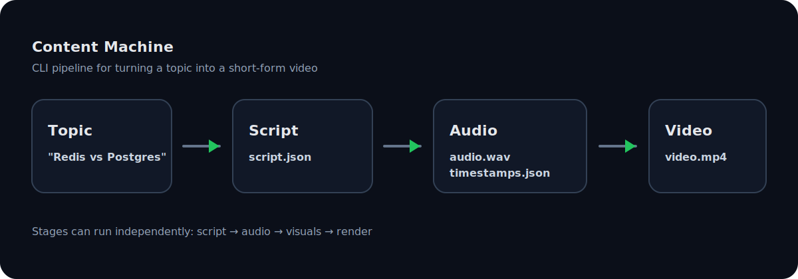

# Content Machine

[](https://github.com/45ck/content-machine/actions/workflows/ci.yml)
[](https://www.npmjs.com/package/@45ck/content-machine)


CLI-first automated short-form video generator for TikTok, Reels, and Shorts.

> **Status:** Early development. Not production-ready yet.



## Install

```bash
# Node.js >= 20 required
npm install -g @45ck/content-machine

# Verify
cm --help

# Or run without installing
npx -y @45ck/content-machine --help
```

## Quickstart

Verify install (no API keys required):

```bash
cm demo -o output/demo.mp4
```

Generate a real video (requires API keys):

```bash
export OPENAI_API_KEY="..."
export PEXELS_API_KEY="..."

cm generate "Redis vs PostgreSQL for caching" \
  --archetype versus \
  --pipeline standard \
  --output output/video.mp4 \
  --keep-artifacts
```

More: [`docs/user/QUICKSTART.md`](docs/user/QUICKSTART.md)

## Docs

Start here:

- User docs: [`docs/user/README.md`](docs/user/README.md)
- Docs portal: [`docs/README.md`](docs/README.md)

Canonical references (generated; do not edit):

- Repo facts: [`docs/reference/REPO-FACTS.md`](docs/reference/REPO-FACTS.md)
- Environment variables: [`docs/reference/ENVIRONMENT-VARIABLES.md`](docs/reference/ENVIRONMENT-VARIABLES.md)
- Glossary (ubiquitous language): [`docs/reference/GLOSSARY.md`](docs/reference/GLOSSARY.md)

Examples and demo gallery:

- Examples: [`docs/user/EXAMPLES.md`](docs/user/EXAMPLES.md)
- Demo media: [`docs/demo/`](docs/demo/)

## How It Works

Content Machine is a 4-stage pipeline:

```
topic -> script.json -> audio.wav + timestamps.json -> visuals.json -> video.mp4
```

Run end-to-end:

```bash
cm generate "Redis vs PostgreSQL" --archetype versus --output output/video.mp4
```

Stage-by-stage usage and full command references live in [`docs/user/CLI.md`](docs/user/CLI.md) and `docs/reference/`.

## Terminology (Ubiquitous Language)

These words mean specific things in this repo:

- **Script archetype**: script format used by `cm script` / `cm generate`
- **Render template**: render preset used by `cm render` / `cm generate`
- **Pipeline workflow**: orchestration preset used by `cm generate`

Canonical glossary (generated): [`docs/reference/GLOSSARY.md`](docs/reference/GLOSSARY.md)

## Development (From Source)

Cloning the repo is only needed for development:

```bash
git clone https://github.com/45ck/content-machine.git
cd content-machine

nvm install
nvm use

npm install
cp .env.example .env

npm run cm -- --help
```

## License

MIT.
