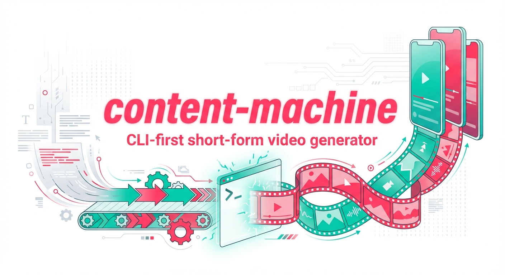
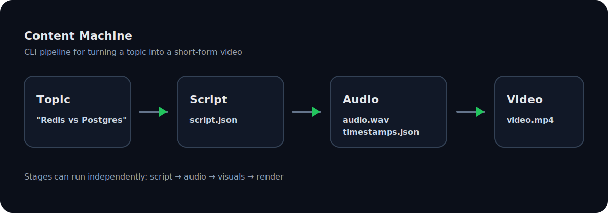

# Content Machine


<p align="center">
  <picture>
    <source media="(prefers-color-scheme: dark)" srcset="assets/banner.dark.png" />
    <source media="(prefers-color-scheme: light)" srcset="assets/banner.light.png" />
    
  </picture>
</p>

**Content Machine is a local-first short-form video toolkit for coding
agents.**

It helps Claude Code, Codex CLI, and similar agents create TikToks,
Instagram Reels, and YouTube Shorts by calling repo-local skills,
flows, and deterministic media scripts.

The goal is simple: turn a topic or source video into a high-quality
vertical short with inspectable artifacts at every step.

Content Machine is moving away from a monolithic "AI video agent" and
toward repo-local skills and `45ck/prompt-language` flows for building
short-form video well. Runtime scripts still exist, but they are support
surfaces behind the skill pack rather than the product story.

```text
source or topic
  -> script / highlight selection
  -> audio + timestamps
  -> visuals
  -> captions + render
  -> quality-gated MP4
```

## Featured Example

The main reference lane in this repo is now the Reddit split-screen
short:

- Reddit screenshot-style opener for the first `4s` to `5s`
- story-related moving footage on the top half
- Subway Surfers gameplay on the bottom half
- midpoint overlay captions with active-word emphasis

Start here:

- [Reddit Story Split-Screen](docs/user/examples/reddit-story-split-screen.md)
- [reddit-story-short skill](skills/reddit-story-short/SKILL.md)
- [reddit-card-overlay skill](skills/reddit-card-overlay/SKILL.md)

<p align="center">
  <video src="docs/demo/demo-8-reddit-story-split-screen.mp4" controls muted playsinline loop width="280"></video>
</p>

## Current Focus

Content Machine is not trying to be a giant all-in-one video app. The
active direction is a small, reliable local runtime that agents can use
well:

- pick strong short-form moments from long videos
- approve highlights before expensive render work
- generate scripts, audio, visuals, captions, and MP4s as separate files
- keep every step inspectable and repeatable
- use skills and flows as the main interface, with `cm` kept thin

Read the current build plan:
[Short-Form Roadmap](docs/direction/07-short-form-roadmap-20260424.md).

Archetype rollout plan:
[Archetype Rollout](docs/direction/08-archetype-rollout-20260427.md).

Tracked preview clip:

- [docs/demo/demo-8-reddit-story-split-screen.mp4](docs/demo/demo-8-reddit-story-split-screen.mp4)

> Early development. Skills, flows, and runtime scripts are now the
> primary interface. The legacy CLI control plane has been moved into
> [`archive/legacy-cli/`](archive/legacy-cli/README.md); the remaining
> `cm` shell is intentionally thin.

> Start with [`skills/`](skills/README.md),
> [`scripts/harness/`](scripts/harness/README.md),
> [`flows/`](flows/README.md), and [`DIRECTION.md`](DIRECTION.md).

## Start Here

```bash
npm install
```

Node.js 20.6+ is required.

### Primary Path: Coding-Agent CLIs

Use these three surfaces together:

- [`skills/`](skills/README.md): importable short-form video skills
- [`flows/`](flows/README.md): `45ck/prompt-language` docs and manifests
- [`scripts/harness/`](scripts/harness/README.md): optional repo-side runners behind the skills

If you are deciding where to start:

- Start with a skill when you want one capability.
- Start with a flow when you want a full multi-step path.
- Start with `scripts/harness/` only when you need the exact repo-side
  executable.

Discover what is shipped:

```bash
cat <<'JSON' | node --import tsx scripts/harness/skill-catalog.ts
{}
JSON

cat <<'JSON' | node --import tsx scripts/harness/flow-catalog.ts
{}
JSON
```

Current repo-side entrypoints:

```bash
node --import tsx scripts/harness/doctor-report.ts
node --import tsx scripts/harness/flow-catalog.ts
node --import tsx scripts/harness/run-flow.ts
node --import tsx scripts/harness/skill-catalog.ts
node --import tsx scripts/harness/generate-short.ts
node --import tsx scripts/harness/brief-to-script.ts
node --import tsx scripts/harness/ingest.ts
node --import tsx scripts/harness/script-to-audio.ts
node --import tsx scripts/harness/timestamps-to-visuals.ts
node --import tsx scripts/harness/video-render.ts
node --import tsx scripts/harness/publish-prep.ts
node --import tsx scripts/harness/install-skill-pack.ts
```

If you want these skills inside another project, install the package
there and materialize a local pack:

```bash
npm install @45ck/content-machine

cat <<'JSON' | node ./node_modules/@45ck/content-machine/agent/run-tool.mjs install-skill-pack
{
  "targetDir": ".content-machine",
  "includeFlows": true
}
JSON
```

Shipped starter skills:

- [skills/doctor-report/SKILL.md](skills/doctor-report/SKILL.md)
- [skills/skill-catalog/SKILL.md](skills/skill-catalog/SKILL.md)
- [skills/short-form-captions/SKILL.md](skills/short-form-captions/SKILL.md)
- [skills/generate-short/SKILL.md](skills/generate-short/SKILL.md)
- [skills/brief-to-script/SKILL.md](skills/brief-to-script/SKILL.md)
- [skills/reverse-engineer-winner/SKILL.md](skills/reverse-engineer-winner/SKILL.md)
- [skills/script-to-audio/SKILL.md](skills/script-to-audio/SKILL.md)
- [skills/timestamps-to-visuals/SKILL.md](skills/timestamps-to-visuals/SKILL.md)
- [skills/video-render/SKILL.md](skills/video-render/SKILL.md)
- [skills/publish-prep-review/SKILL.md](skills/publish-prep-review/SKILL.md)

### Thin `cm` Shell

```bash
npm run cm -- --help
```

Only `config`, `doctor`, `mcp`, and `render` remain live under `cm`.
Everything else now lives in [`archive/legacy-cli/`](archive/legacy-cli/README.md).

See [full installation guide](docs/user/INSTALLATION.md) for optional
setup such as Whisper and `ffmpeg`.

## Quick Start

Run diagnostics:

```bash
cat skills/doctor-report/examples/request.json | \
  node --import tsx scripts/harness/doctor-report.ts
```

Then use the featured example instead of a generic demo:

- [Reddit Story Split-Screen](docs/user/examples/reddit-story-split-screen.md)
- [Codex Empty-Project Eval](experiments/codex-reddit-story-empty-project-v1/README.md)

Run the main short-form flow:

```bash
cat <<'JSON' | node --import tsx scripts/harness/run-flow.ts
{
  "flow": "generate-short",
  "runId": "demo-run",
  "input": {
    "topic": "Redis vs PostgreSQL for caching",
    "audio": { "voice": "af_heart" },
    "visuals": { "provider": "pexels", "orientation": "portrait" },
    "render": { "fps": 30, "downloadAssets": true },
    "publishPrep": { "enabled": true, "platform": "tiktok" }
  }
}
JSON
```

The full beginner path is here:
[Agent Quickstart](docs/user/AGENT-QUICKSTART.md).

## How To Use It

Use one of three surfaces:

- [skills/](skills/README.md) when an agent needs one capability
- [flows/](flows/README.md) when an agent needs a multi-step workflow
- [scripts/harness/](scripts/harness/README.md) when you need the exact
  executable JSON-stdio entrypoint

The remaining `cm` CLI is intentionally small:

```bash
npm run cm -- --help
```

Use it for config, diagnostics, MCP, and render compatibility. Archived
legacy CLI notes live in [archive/legacy-cli/](archive/legacy-cli/README.md).

## Read Deeper

Start here, then follow links downward:

- [Reddit Story Split-Screen](docs/user/examples/reddit-story-split-screen.md) -
  primary example lane
- [Agent Quickstart](docs/user/AGENT-QUICKSTART.md) - quickest user path
- [Skills](skills/README.md) - all agent-facing capabilities
- [Flows](flows/README.md) - orchestration patterns
- [Harness Scripts](scripts/harness/README.md) - executable runtime entrypoints
- [Short-Form Roadmap](docs/direction/07-short-form-roadmap-20260424.md) -
  what we are building next and why
- [Archetype Rollout](docs/direction/08-archetype-rollout-20260427.md) -
  which short-form lanes exist, which are proven, and what gets built next
- [Direction](DIRECTION.md) - product boundaries and migration decisions
- [User Guide](docs/user/README.md) - broader usage docs
- [Developer Docs](docs/dev/README.md) - architecture, registries, and internals
- [Research](docs/research/00-SUMMARY-20260102.md) - reference repo findings and experiments
- [Reference](docs/reference/) - generated glossary, facts, and CLI reference
- [Archive](archive/README.md) - frozen legacy code and notes

The primary user guide is now
[docs/user/AGENT-QUICKSTART.md](docs/user/AGENT-QUICKSTART.md). The
archived CLI notes live under
[archive/legacy-cli/](archive/legacy-cli/README.md).

## How The Repo Is Shaped

```text
skills/            agent-readable capability docs
flows/             multi-step prompt-language workflows
scripts/harness/   JSON-stdio runtime entrypoints
src/               TypeScript media, render, scoring, and provider logic
docs/              user, developer, direction, research, and reference docs
archive/           retired legacy surfaces
```

Run-scoped flows write under `runs/<run-id>/` by default. Direct skills
can also write to explicit output paths.

## What You Can Do

- Generate a short-form video from a topic.
- Reverse-engineer a winning reference short from a local file or URL.
- Generate only scripts, audio, visuals, or renders when needed.
- Run structured diagnostics before expensive generation work.
- Use the thin `cm` shell only for config, diagnostics, MCP, or render compatibility.



## Documentation

- **[Agent Quickstart](docs/user/AGENT-QUICKSTART.md)** — primary user path for Claude Code, Codex CLI, and similar tools
- **[skills/](skills/README.md)** — agent-facing skill docs
- **[flows/](flows/README.md)** — `45ck/prompt-language` docs and executable flows
- **[scripts/harness/](scripts/harness/README.md)** — optional repo-side runners and execution model
- **[Direction](DIRECTION.md)** — migration plan, cut lines, and archive policy
- **[User Guide](docs/user/README.md)** — skill-pack docs
- **[Developer Docs](docs/dev/README.md)** — active architecture, registries, and legacy engineering docs
- **[Reference](docs/reference/)** — generated references, environment variables, glossary, and CLI details
- **[Archive](archive/README.md)** — frozen legacy control-plane code and notes

## Contributing

See [CONTRIBUTING.md](CONTRIBUTING.md).

```bash
git clone https://github.com/45ck/content-machine.git
cd content-machine
npm install
npm run quality
```

## License

MIT
