# Deep Dive #47: Connectors, Publishing & MCP Infrastructure

**Date:** 2026-01-02  
**Category:** Integration Infrastructure  
**Status:** Complete

---

## Executive Summary

This deep dive analyzes the vendored connector, publishing, and MCP server infrastructure. These components form the input/output backbone of any automated content pipeline—sourcing trending content and publishing finished videos.

**Key Findings:**

1. **Reddit MCP servers exist** and work without API keys (scraping-based)
2. **TiktokAutoUploader** is production-ready, using requests not Selenium (3 seconds upload)
3. **Mixpost** is a full social media management platform (Laravel-based)
4. **yt-dlp** is the definitive video download tool (1000+ sites supported)
5. **FastMCP 2.0** is the production standard for MCP server development

---

## Connector Analysis

### Reddit Connectors

#### 1. reddit-mcp-buddy ⭐ (Champion)

**Type:** MCP Server (TypeScript)  
**License:** MIT  
**API Keys:** Not required!

**Features:**

- Browse subreddits (hot, new, top, rising, controversial)
- Search across Reddit
- Get post details with full comment threads
- User analysis (karma, posts, activity)
- Reddit terminology explanations

**Rate Limits (Three-Tier):**

- No auth: 10 requests/minute
- OAuth: 60 requests/minute
- Script app: 100 requests/minute

**Installation:**

```json
// claude_desktop_config.json
{
  "mcpServers": {
    "reddit": {
      "command": "npx",
      "args": ["-y", "reddit-mcp-buddy"]
    }
  }
}
```

**Tools:**

- `browse_subreddit` - Browse posts with sorting
- `search_reddit` - Search with filters
- `get_post_details` - Fetch post + comments
- `user_analysis` - Analyze user profile
- `reddit_explain` - Explain Reddit terms

**Why This is Best:** Zero setup, TypeScript, actively maintained, MCP-native.

---

#### 2. praw (Python Reddit API Wrapper)

**Type:** Python Library  
**License:** BSD-2-Clause  
**Stars:** 3k+

**Official Reddit API wrapper.** Requires API credentials but provides full access.

```python
import praw

reddit = praw.Reddit(
    client_id="YOUR_CLIENT_ID",
    client_secret="YOUR_CLIENT_SECRET",
    user_agent="content-machine:v1.0"
)

for submission in reddit.subreddit("technology").hot(limit=10):
    print(submission.title)
```

---

#### 3. asyncpraw

**Type:** Python Library (Async)  
**License:** BSD-2-Clause

Async version of PRAW for high-performance applications.

```python
import asyncpraw

reddit = asyncpraw.Reddit(...)
async for submission in reddit.subreddit("all").hot(limit=100):
    print(submission.title)
```

---

### YouTube Connectors

#### 1. yt-dlp ⭐ (Champion)

**Type:** CLI + Python Library  
**License:** Unlicense  
**Sites Supported:** 1000+

The definitive video/audio downloader. Fork of youtube-dl with active development.

**Key Features:**

- Download from 1000+ sites
- Format selection (quality, codec)
- Subtitle extraction
- SponsorBlock integration
- Playlist handling
- Live stream support

**CLI Usage:**

```bash
# Download best quality
yt-dlp "https://youtube.com/watch?v=..."

# Audio only (MP3)
yt-dlp -x --audio-format mp3 "URL"

# With subtitles
yt-dlp --write-subs --sub-lang en "URL"

# Best format for shorts (vertical)
yt-dlp -f "bestvideo[height<=1920]+bestaudio" "URL"
```

**Python Embedding:**

```python
import yt_dlp

ydl_opts = {
    'format': 'bestvideo[height<=1080]+bestaudio/best',
    'outtmpl': 'downloads/%(title)s.%(ext)s',
    'writesubtitles': True,
}

with yt_dlp.YoutubeDL(ydl_opts) as ydl:
    info = ydl.extract_info(url, download=True)
```

---

#### 2. youtube-transcript-api ⭐

**Type:** Python Library  
**License:** MIT

Extract transcripts/subtitles from YouTube videos without Selenium.

```python
from youtube_transcript_api import YouTubeTranscriptApi

ytt_api = YouTubeTranscriptApi()
transcript = ytt_api.fetch("video_id")

# Returns timestamped text:
# [{"text": "Hey there", "start": 0.0, "duration": 1.5}, ...]
```

**Key Features:**

- Auto-generated captions support
- Multi-language support
- Translation support
- No browser required

---

#### 3. google-api-python

**Type:** Python Library  
**License:** Apache-2.0

Official Google API client for YouTube Data API v3.

```python
from googleapiclient.discovery import build

youtube = build('youtube', 'v3', developerKey='API_KEY')

request = youtube.search().list(
    part="snippet",
    q="AI automation",
    type="video",
    videoDuration="short"  # < 4 minutes
)
response = request.execute()
```

---

### Web Scrapers/Connectors

Located in `vendor/connectors/scrapers/` and `vendor/connectors/web/`:

- General purpose web scraping utilities
- Rate limiting helpers
- Proxy rotation

---

## Publishing Infrastructure

### 1. TiktokAutoUploader ⭐ (Champion for TikTok)

**Language:** Python + Node.js  
**License:** MIT  
**Speed:** ~3 seconds per upload

**Key Innovation:** Uses requests, not Selenium!

**Features:**

- ✅ Super fast (requests-based)
- ✅ Multiple account support
- ✅ Schedule up to 10 days ahead
- ✅ YouTube Shorts → TikTok conversion
- ✅ Cookie-based authentication

**Requirements:**

- Node.js (for signature generation)
- Python 3.x

**CLI Usage:**

```bash
# Login (saves cookies)
python cli.py login -n my_account

# Upload video
python cli.py upload --user my_account -v "video.mp4" -t "My title"

# Upload from YouTube Shorts
python cli.py upload --user my_account -yt "https://youtube.com/shorts/..." -t "Title"
```

**Session ID Extraction:**

1. Log into TikTok in browser
2. Copy `sessionid` cookie value
3. Use in configuration

---

### 2. Mixpost ⭐ (Full Platform)

**Language:** PHP (Laravel)  
**License:** MIT  
**Type:** Self-hosted social media management

**Supported Platforms:**

- Facebook
- Instagram
- Twitter/X
- LinkedIn
- Pinterest
- TikTok
- YouTube
- Mastodon

**Features:**

- Multi-account management
- Content calendar
- Post scheduling
- Analytics
- Team collaboration
- Workspaces
- Media library
- Post templates
- Hashtag groups

**Commercial Versions:**

- **Lite:** Open source (MIT)
- **Pro/Enterprise:** Paid, additional features

**Installation:** Laravel-based, requires PHP + database

---

### 3. youtube-upload

**Type:** CLI Tool  
**For:** YouTube API uploads

Simple CLI for uploading videos to YouTube with metadata.

---

### 4. go-youtube-reddit-automation

**Language:** Go  
**Purpose:** Combined automation for Reddit → YouTube pipeline

---

### 5. rednote-instagram-auto-uploader

**Purpose:** Instagram posting automation (RedNote integration)

---

## MCP Server Infrastructure

### 1. FastMCP 2.0 ⭐ (Production Standard)

**Language:** Python  
**Creator:** Prefect  
**Docs:** gofastmcp.com

The production-ready MCP server framework.

**Features:**

- Decorator-based tools/resources
- Enterprise auth (Google, GitHub, Azure, Auth0, WorkOS)
- OpenAPI/FastAPI generation
- Server composition
- Proxy servers
- Testing utilities
- Client libraries

**Basic Server:**

```python
from fastmcp import FastMCP

mcp = FastMCP("Demo 🚀")

@mcp.tool
def add(a: int, b: int) -> int:
    """Add two numbers"""
    return a + b

@mcp.resource("config://version")
def get_version():
    return "2.0.1"

if __name__ == "__main__":
    mcp.run()
```

**Run:**

```bash
fastmcp run server.py
```

**LLM Documentation:**

- `llms.txt` - Sitemap for LLMs
- `llms-full.txt` - Complete docs

---

### 2. mcp-python-sdk

**Type:** Official MCP Python SDK  
**Note:** FastMCP 1.0 was incorporated into this

Use FastMCP 2.0 for production; SDK for low-level access.

---

### 3. fastmcp-typescript

**Language:** TypeScript  
**Use Case:** TypeScript MCP servers

TypeScript equivalent of FastMCP for Node.js environments.

---

### 4. mcp-quickstart

**Purpose:** Getting started templates

---

### 5. mcp-servers

**Purpose:** Reference server implementations

Collection of example MCP servers for various use cases.

---

## MoneyPrinter Family Analysis

### MoneyPrinter (Original)

**Creator:** FujiwaraChoki  
**Stars:** 7.5k+  
**License:** MIT

Original viral repo for YouTube Shorts automation.

**Stack:**

- ImageMagick
- TTS (various)
- FFmpeg

**Limitations:**

- Selenium-based (slow)
- Basic features
- Less actively maintained

---

### MoneyPrinterTurbo ⭐ (Best Fork)

**Creator:** harry0703  
**Stars:** 8k+  
**License:** MIT

Chinese fork with significant improvements.

**Features:**

- Web UI + API
- MVC architecture
- Multiple LLM support:
  - OpenAI, Moonshot, Azure
  - gpt4free, one-api
  - Tongyi Qianwen, Google Gemini
  - Ollama, DeepSeek, Wenxin
  - Pollinations, ModelScope
- Batch video generation
- Clip duration settings
- Multiple voices with preview
- Customizable subtitles
- Background music
- Pexels integration (royalty-free)
- Docker support
- Google Colab notebook

**Recommended LLMs (China-friendly):**

- DeepSeek
- Moonshot

**Video Formats:**

- Vertical: 9:16 (1080x1920)
- Horizontal: 16:9 (1920x1080)

**System Requirements:**

- CPU: 4+ cores
- RAM: 4GB+
- GPU: Optional

---

### MoneyPrinterV2

**Creator:** FujiwaraChoki  
**License:** AGPL-3.0

Version 2 with expanded features.

**Features:**

- Twitter Bot with CRON scheduling
- YouTube Shorts automation
- Affiliate marketing (Amazon + Twitter)
- Local business finder + cold outreach

**Stack:**

- CoquiTTS
- gpt4free
- Go (for email outreach)

**Note:** AGPL license may have implications for commercial use.

---

## Integration Recommendations

### For content-machine: Connector Stack

```typescript
// Recommended connector configuration

// Reddit Trends
const redditMCP = new RedditMCPBuddy({
  // No API keys needed!
});

// YouTube Research
const ytTranscript = new YouTubeTranscriptAPI();
const ytDownloader = new YtDlp({
  format: 'bestvideo[height<=1080]+bestaudio',
});

// Publishing
const tiktokUploader = new TiktokAutoUploader({
  accounts: ['account1', 'account2'],
});
const mixpost = new MixpostClient({
  // For multi-platform publishing
});
```

### Connector Priority

| Use Case            | Champion               | Backup              |
| ------------------- | ---------------------- | ------------------- |
| Reddit Trends       | reddit-mcp-buddy       | praw/asyncpraw      |
| YouTube Download    | yt-dlp                 | pytube              |
| YouTube Transcripts | youtube-transcript-api | yt-dlp --write-subs |
| TikTok Upload       | TiktokAutoUploader     | Manual              |
| Multi-Platform      | Mixpost                | Postiz              |
| MCP Development     | FastMCP 2.0            | mcp-python-sdk      |

### Publishing Strategy

```mermaid
graph LR
    A[Rendered Video] --> B{Review Approved?}
    B -->|Yes| C[TiktokAutoUploader]
    B -->|Yes| D[YouTube API]
    B -->|Yes| E[Mixpost → Instagram]
    B -->|No| F[Back to Edit]
```



---

## Security Considerations

### API Key Management

- Use environment variables
- Never commit credentials
- Rotate keys regularly

### Cookie-Based Auth (TikTok)

- Session IDs expire
- Implement refresh logic
- Monitor for rate limits

### Reddit API

- reddit-mcp-buddy scrapes (no ToS issues with MCP pattern)
- PRAW requires registered app
- Respect rate limits

### YouTube

- YouTube Data API has quotas
- yt-dlp doesn't require API key
- Consider YouTube ToS for automation

---

## Performance Benchmarks

### Upload Speed

- **TiktokAutoUploader:** ~3 seconds
- **Selenium-based:** 30-60 seconds
- **Manual API:** 5-10 seconds

### Download Speed (yt-dlp)

- Typically network-limited
- Parallel segments supported
- Resume on failure

### MCP Server Response

- **FastMCP:** <100ms typical
- Tool execution: varies by implementation

---

## Code Patterns

### Reddit Trend Extraction

```python
# Using reddit-mcp-buddy via MCP
async def get_trending_tech():
    result = await mcp_client.call_tool(
        "browse_subreddit",
        {
            "subreddit": "technology",
            "sort": "hot",
            "limit": 10
        }
    )
    return result.posts
```

### Video Download Pattern

```python
import yt_dlp

def download_background_video(url: str, output_dir: str):
    opts = {
        'format': 'bestvideo[height<=1080][ext=mp4]+bestaudio[ext=m4a]/mp4',
        'outtmpl': f'{output_dir}/%(id)s.%(ext)s',
        'quiet': True,
        'no_warnings': True
    }
    with yt_dlp.YoutubeDL(opts) as ydl:
        info = ydl.extract_info(url, download=True)
        return f"{output_dir}/{info['id']}.mp4"
```

### TikTok Upload Pattern

```python
import subprocess

def upload_to_tiktok(video_path: str, title: str, account: str):
    result = subprocess.run([
        "python", "cli.py", "upload",
        "--user", account,
        "-v", video_path,
        "-t", title
    ], capture_output=True, text=True)
    return result.returncode == 0
```

### FastMCP Tool Pattern

```python
from fastmcp import FastMCP

mcp = FastMCP("ContentMachine")

@mcp.tool
async def get_trending_topics(
    subreddit: str = "technology",
    limit: int = 10
) -> list[dict]:
    """Get trending topics from a subreddit."""
    # Implementation
    return topics

@mcp.resource("trends://reddit/{subreddit}")
async def reddit_trends(subreddit: str):
    """Resource for Reddit trends."""
    return await get_trending_topics(subreddit)
```

---

## Next Steps

1. **Setup reddit-mcp-buddy** as primary trend source
2. **Integrate yt-dlp** for background video sourcing
3. **Configure TiktokAutoUploader** for publishing
4. **Evaluate Mixpost** for multi-platform strategy
5. **Build content-machine MCP servers** using FastMCP 2.0

---

## References

- [reddit-mcp-buddy](https://github.com/karanb192/reddit-mcp-buddy)
- [yt-dlp](https://github.com/yt-dlp/yt-dlp)
- [youtube-transcript-api](https://github.com/jdepoix/youtube-transcript-api)
- [TiktokAutoUploader](https://github.com/makiisthenes/TiktokAutoUploader)
- [Mixpost](https://github.com/inovector/mixpost)
- [FastMCP](https://gofastmcp.com)
- [MoneyPrinterTurbo](https://github.com/harry0703/MoneyPrinterTurbo)

---

**Document ID:** DD-047  
**Last Updated:** 2026-01-02  
**Author:** Research Agent
