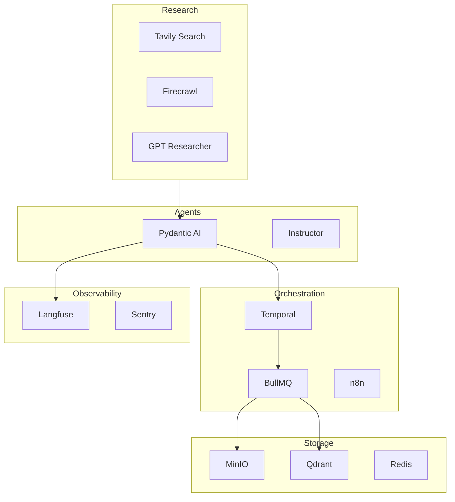

# Deep Dive #48: Infrastructure & Platform Tools

**Date:** 2026-01-02  
**Category:** Platform Infrastructure  
**Status:** Complete

---

## Executive Summary

This deep dive analyzes the foundational infrastructure vendored for content-machine: vector databases, orchestration platforms, job queues, observability tools, agent frameworks, schema validation, web connectors, and research agents.

**Key Findings:**

1. **Qdrant** is the recommended vector database (Rust, blazing fast, MIT)
2. **Temporal** is superior for durable workflow execution; **n8n** for visual workflows
3. **BullMQ** is the definitive TypeScript queue (Redis-based)
4. **Langfuse** provides comprehensive LLM observability (MIT, self-hostable)
5. **Pydantic AI** brings FastAPI-level ergonomics to agent development
6. **Firecrawl** + **Tavily** = web research superpowers
7. **GPT Researcher** / **Open Deep Research** = automated research agents

---

## Vector Databases

### 1. Qdrant ⭐ (Champion)

**Language:** Rust  
**License:** Apache-2.0  
**Stars:** 16k+

High-performance vector similarity search engine.

**Key Features:**

- Written in Rust (speed + reliability)
- Production-ready
- Extended filtering support
- Payload storage (vectors + metadata)
- Distributed mode
- Client libraries: Python, Node.js, Go, Rust, .NET, Java

**Quick Start:**

```bash
# Docker
docker run -p 6333:6333 qdrant/qdrant

# Python
pip install qdrant-client
```

```python
from qdrant_client import QdrantClient

# In-memory (testing)
qdrant = QdrantClient(":memory:")

# Connect to server
qdrant = QdrantClient("http://localhost:6333")
```

**Use Cases:**

- Embedding storage for semantic search
- Similar video retrieval
- Content deduplication

---

### 2. Weaviate

**Language:** Go  
**License:** BSD-3-Clause  
**Stars:** 10k+

Cloud-native vector database with built-in ML model integration.

**Key Features:**

- Hybrid search (vector + keyword)
- Built-in vectorizers (OpenAI, Cohere, HuggingFace)
- GraphQL API
- Multi-tenancy
- RAG-ready

```python
import weaviate
from weaviate.classes.config import Configure

client = weaviate.connect_to_local()

# Create collection with auto-vectorization
client.collections.create(
    name="Article",
    vector_config=Configure.Vectors.text2vec_model2vec()
)
```

---

### 3. MinIO ⭐ (Object Storage)

**Type:** S3-compatible object storage  
**License:** AGPL-3.0

**Use Case:** Store rendered videos, assets, thumbnails

```bash
docker run -p 9000:9000 -p 9001:9001 \
  -e "MINIO_ROOT_USER=admin" \
  -e "MINIO_ROOT_PASSWORD=password" \
  minio/minio server /data --console-address ":9001"
```

---

## Orchestration Platforms

### 1. Temporal ⭐ (Champion for Durable Execution)

**Language:** Go  
**License:** MIT  
**Stars:** 11k+

Durable execution platform for resilient workflows.

**Key Features:**

- Automatic retry on failures
- Long-running workflow support
- Version-safe updates
- Multi-language SDKs (Go, Java, Python, TypeScript)
- Web UI for monitoring

```bash
brew install temporal
temporal server start-dev
```

**Concepts:**

- **Workflow:** Orchestration logic (survives crashes)
- **Activity:** Individual task execution
- **Worker:** Process that runs activities

**When to Use:**

- Complex multi-step pipelines
- Long-running async operations
- Business-critical workflows

---

### 2. n8n ⭐ (Champion for Visual Workflows)

**Language:** TypeScript  
**License:** Sustainable Use License (fair-code)  
**Stars:** 43k+

Visual workflow automation with 400+ integrations.

**Key Features:**

- No-code / low-code interface
- AI-native (LangChain integration)
- 400+ pre-built integrations
- Self-hostable
- Enterprise features (SSO, permissions)

```bash
# Quick start
npx n8n

# Docker
docker run -it --rm --name n8n -p 5678:5678 docker.n8n.io/n8nio/n8n
```

**When to Use:**

- Visual workflow design
- Non-developer team members
- Rapid prototyping
- Integration-heavy workflows

---

### 3. Airflow

**Language:** Python  
**Use Case:** DAG-based batch processing  
**Note:** Overkill for real-time; better for scheduled jobs

---

## Job Queues

### 1. BullMQ ⭐ (Champion for TypeScript)

**Language:** TypeScript  
**License:** MIT  
**Backend:** Redis

The fastest Redis-based distributed queue for Node.js.

**Key Features:**

- Rock-solid stability
- Atomic operations
- Rate limiting
- Delayed jobs
- Priority queues
- Flow dependencies
- Sandboxed processors

```typescript
import { Queue, Worker } from 'bullmq';

const renderQueue = new Queue('video-render', { connection: { host: 'localhost' } });

// Add job
await renderQueue.add('render', { videoId: '123', config: {...} });

// Process jobs
const worker = new Worker('video-render', async (job) => {
  await renderVideo(job.data);
});
```

**Use Cases:**

- Video rendering pipeline
- Background processing
- Scheduled tasks
- Batch operations

---

### 2. RQ (Redis Queue)

**Language:** Python  
**License:** BSD  
**Backend:** Redis

Simple Python job queue.

```python
from redis import Redis
from rq import Queue

q = Queue(connection=Redis())
job = q.enqueue(render_video, video_config)
```

---

### 3. Celery

**Language:** Python  
**License:** BSD  
**Use Case:** Distributed task processing (heavier than RQ)

---

## Observability

### 1. Langfuse ⭐ (Champion for LLM Observability)

**Language:** TypeScript + Python  
**License:** MIT  
**Stars:** 6k+

Open-source LLM engineering platform.

**Core Features:**

- LLM tracing (all prompts, completions, tokens)
- Prompt management (version control)
- Evaluations (LLM-as-judge, user feedback)
- Datasets for benchmarking
- Playground for prompt iteration
- Comprehensive API

**Self-Hosting:**

```yaml
# docker-compose.yml
services:
  langfuse:
    image: langfuse/langfuse
    ports:
      - '3000:3000'
```

**Python Integration:**

```python
from langfuse import Langfuse

langfuse = Langfuse()

trace = langfuse.trace(name="content-generation")
span = trace.span(name="llm-call")
# ... LLM call
span.end(output=result)
```

---

### 2. Promptfoo

**Type:** LLM evaluation framework  
**Use Case:** Systematic prompt testing

```bash
npx promptfoo@latest init
npx promptfoo@latest eval
```

---

### 3. Sentry

**Type:** Error tracking  
**Use Case:** Production error monitoring

---

### 4. OpenTelemetry

**Type:** Distributed tracing standard  
**Use Case:** Cross-service observability

---

## Agent Frameworks

### 1. Pydantic AI ⭐ (Champion for Python Agents)

**Creator:** Pydantic Team  
**License:** MIT  
**Philosophy:** "FastAPI for GenAI"

Production-grade agent framework with Pydantic validation.

**Key Features:**

- Model-agnostic (40+ providers)
- Type-safe with IDE support
- Tool calling with dependency injection
- MCP integration
- Agent-to-Agent (A2A) protocol
- Durable execution support
- Streaming structured outputs
- Graph support

```python
from pydantic_ai import Agent

agent = Agent(
    'anthropic:claude-sonnet-4-0',
    instructions='Be concise, reply with one sentence.'
)

result = agent.run_sync('Where does "hello world" come from?')
print(result.output)
```

**Tool Example:**

```python
from dataclasses import dataclass
from pydantic_ai import Agent, RunContext

@dataclass
class Dependencies:
    db: DatabaseConn

agent = Agent('openai:gpt-4o', deps_type=Dependencies)

@agent.tool
async def get_user(ctx: RunContext[Dependencies], user_id: int) -> dict:
    return await ctx.deps.db.get_user(user_id)
```

---

### 2. LangGraph

**Type:** Graph-based agent orchestration  
**Use Case:** Complex multi-step agent workflows  
**Note:** Used by Open Deep Research

---

### 3. LangChain

**Type:** LLM application framework  
**Use Case:** Chains, agents, tools  
**Note:** Good for building blocks, can be verbose

---

### 4. CrewAI

**Type:** Multi-agent collaboration  
**Use Case:** Team of specialized agents

---

### 5. LlamaIndex

**Type:** RAG framework  
**Use Case:** Document retrieval, indexing

---

## Schema Validation

### 1. Zod ⭐ (Champion for TypeScript)

**Language:** TypeScript  
**License:** MIT  
**Stars:** 33k+

TypeScript-first schema validation with static type inference.

```typescript
import * as z from 'zod';

const VideoConfig = z.object({
  id: z.string().uuid(),
  title: z.string().min(1).max(100),
  duration: z.number().min(5).max(60),
  voice: z.enum(['alloy', 'echo', 'nova']),
  captions: z.boolean().default(true),
});

type VideoConfig = z.infer<typeof VideoConfig>;

// Parse and validate
const config = VideoConfig.parse(input);
```

---

### 2. Pydantic ⭐ (Champion for Python)

**Language:** Python  
**Use Case:** Data validation in FastAPI, agents, etc.

```python
from pydantic import BaseModel

class VideoConfig(BaseModel):
    id: str
    title: str
    duration: int
    voice: Literal['alloy', 'echo', 'nova']
    captions: bool = True
```

---

### 3. Instructor ⭐ (Champion for LLM Structured Outputs)

**Use Case:** Extract structured data from LLM outputs

```python
import instructor
from openai import OpenAI
from pydantic import BaseModel

client = instructor.from_openai(OpenAI())

class ContentPlan(BaseModel):
    title: str
    hook: str
    scenes: list[str]

plan = client.chat.completions.create(
    model="gpt-4o",
    response_model=ContentPlan,
    messages=[{"role": "user", "content": "Plan a video about AI"}]
)
```

---

### 4. AJV

**Type:** JSON Schema validator (JavaScript)  
**Use Case:** Runtime validation against JSON schemas

---

## Web Research Tools

### 1. Firecrawl ⭐ (Champion for Web Crawling)

**Type:** Web scraping API  
**License:** AGPL-3.0 (commercial options)

Crawl websites and convert to LLM-ready markdown.

**Key Features:**

- URL → clean markdown
- Crawl entire sites
- Map all URLs (fast)
- Search + full content
- LLM extraction (structured data)
- PDF/DOCX parsing
- Image extraction
- JavaScript rendering

```python
from firecrawl import FirecrawlApp

app = FirecrawlApp(api_key='YOUR_KEY')

# Crawl entire site
result = app.crawl_url('https://docs.example.com', {
    'limit': 100,
    'scrapeOptions': {'formats': ['markdown']}
})
```

**Integrations:** LangChain, LlamaIndex, CrewAI, Dify, n8n

---

### 2. Tavily ⭐ (Champion for AI Search)

**Type:** Search API for AI agents  
**License:** Proprietary (free tier available)

Purpose-built search for LLMs.

**Key Features:**

- Search with source citations
- RAG context generation
- Q&A search
- Extract from URLs
- Optimized for AI consumption

```python
from tavily import TavilyClient

client = TavilyClient(api_key='tvly-YOUR_KEY')

# Search
response = client.search("Who is Leo Messi?")

# RAG context
context = client.get_search_context(query="Burning Man floods")

# Q&A
answer = client.qna_search(query="Who won the World Cup 2022?")
```

---

### 3. PyTrends (Google Trends)

**Type:** Unofficial Google Trends API  
**Use Case:** Trend research

```python
from pytrends.request import TrendReq

pytrends = TrendReq(hl='en-US', tz=360)
pytrends.build_payload(['AI', 'machine learning'], timeframe='today 5-y')
interest = pytrends.interest_over_time()
```

---

### 4. HackerNews Algolia Search

**Type:** HN search API  
**Use Case:** Tech trend research

---

## Research Agents

### 1. GPT Researcher ⭐

**License:** MIT  
**Stars:** 14k+

Autonomous research agent for comprehensive reports.

**Architecture:**

1. Generate research questions
2. Crawl and gather information
3. Summarize and source-track
4. Filter and aggregate
5. Generate final report

**Features:**

- 2000+ word reports
- 20+ source aggregation
- PDF/Word export
- Image scraping
- JavaScript-rendered pages

```bash
pip install gpt-researcher
```

```python
from gpt_researcher import GPTResearcher

researcher = GPTResearcher(query="Latest AI trends")
report = await researcher.conduct_research()
```

---

### 2. Open Deep Research ⭐ (LangChain)

**Framework:** LangGraph  
**License:** MIT

Open-source deep research agent competitive with commercial solutions.

**Key Features:**

- Multi-model support
- MCP compatibility
- Configurable search APIs
- LangGraph Studio UI
- Evaluation framework (Deep Research Bench)

**Architecture:**

- Summarization model
- Research model (search agent)
- Compression model
- Final report model

```bash
git clone https://github.com/langchain-ai/open_deep_research.git
uv sync
langgraph dev
```

---

## Review/Admin UI

### 1. Appsmith ⭐

**Type:** Low-code internal tools  
**License:** Apache-2.0  
**Stars:** 30k+

Build admin panels, dashboards, and approval workflows.

**Key Features:**

- Visual app builder
- 45+ database connectors
- REST/GraphQL support
- JavaScript customization
- Self-hostable

**Use Cases:**

- Content review dashboard
- Video approval workflow
- Analytics panels

---

### 2. Budibase

**Type:** Low-code platform  
**License:** GPL-3.0  
**Stars:** 20k+

Similar to Appsmith with different design philosophy.

**Key Features:**

- Open-source
- Database integration
- Automation workflows
- Self-hosted or cloud

---

### 3. React Admin

**Type:** React framework for admin UIs  
**Use Case:** Custom admin panel development

---

## Recommended Stack for content-machine

### Storage Layer

| Component      | Tool       | Purpose                     |
| -------------- | ---------- | --------------------------- |
| Object Storage | MinIO      | Videos, assets, thumbnails  |
| Vector DB      | Qdrant     | Embeddings, semantic search |
| Queue Backend  | Redis      | BullMQ backend              |
| Database       | PostgreSQL | Metadata, configs           |

### Orchestration Layer

| Component        | Tool     | Purpose                       |
| ---------------- | -------- | ----------------------------- |
| Workflows        | Temporal | Complex pipelines, durability |
| Visual Workflows | n8n      | Integrations, prototyping     |
| Job Queue        | BullMQ   | Background tasks              |

### Agent Layer

| Component             | Tool               | Purpose                    |
| --------------------- | ------------------ | -------------------------- |
| Python Agents         | Pydantic AI        | Content planning, research |
| LLM Structured Output | Instructor         | Structured data extraction |
| Research              | Open Deep Research | Trend research automation  |

### Observability Layer

| Component      | Tool          | Purpose                  |
| -------------- | ------------- | ------------------------ |
| LLM Tracing    | Langfuse      | Debug, monitor, evaluate |
| Error Tracking | Sentry        | Production errors        |
| Metrics        | OpenTelemetry | Cross-service metrics    |
| Eval           | Promptfoo     | Prompt testing           |

### Schema Layer

| Component  | Tool       | Purpose               |
| ---------- | ---------- | --------------------- |
| TypeScript | Zod        | Runtime validation    |
| Python     | Pydantic   | Data models           |
| LLM Output | Instructor | Structured extraction |

### Web Research Layer

| Component    | Tool        | Purpose         |
| ------------ | ----------- | --------------- |
| Web Crawling | Firecrawl   | Site → Markdown |
| AI Search    | Tavily      | Agent search    |
| Trends       | PyTrends    | Google Trends   |
| HackerNews   | Algolia API | Tech trends     |

---

## Integration Architecture



---

## Next Steps

1. **Setup Qdrant** for embedding storage
2. **Configure BullMQ** for rendering pipeline
3. **Deploy Langfuse** for LLM observability
4. **Implement content planner** with Pydantic AI
5. **Integrate Tavily/Firecrawl** for trend research
6. **Build review dashboard** with Appsmith/Budibase

---

## References

- [Qdrant](https://qdrant.tech/)
- [Weaviate](https://weaviate.io/)
- [Temporal](https://temporal.io/)
- [n8n](https://n8n.io/)
- [BullMQ](https://bullmq.io/)
- [Langfuse](https://langfuse.com/)
- [Pydantic AI](https://ai.pydantic.dev/)
- [Firecrawl](https://firecrawl.dev/)
- [Tavily](https://tavily.com/)
- [GPT Researcher](https://gptr.dev/)
- [Open Deep Research](https://github.com/langchain-ai/open_deep_research)
- [Appsmith](https://www.appsmith.com/)
- [Budibase](https://budibase.com/)

---

**Document ID:** DD-048  
**Last Updated:** 2026-01-02  
**Author:** Research Agent
