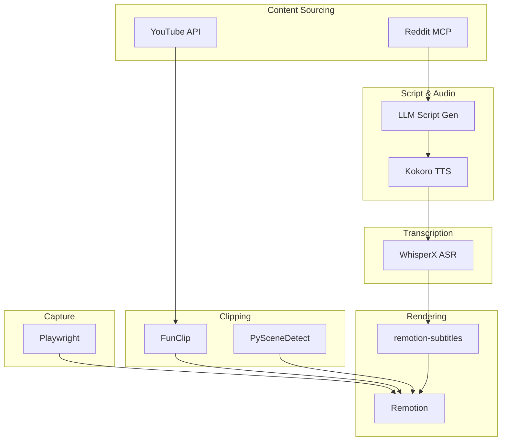

# Deep Dive #49: Rendering, Captions, Clipping & Video Processing

**Date:** 2026-01-02  
**Category:** Video Production Pipeline  
**Status:** Complete

---

## Executive Summary

This deep dive covers the core video production toolchain: rendering engines, caption generation, intelligent clipping, and video processing libraries. These tools form the heart of any automated video creation pipeline.

**Key Findings:**

1. **Remotion** + **remotion-subtitles** = Production-ready React-based rendering with 17 caption styles
2. **chuk-mcp-remotion** bridges AI agents to Remotion via MCP with 51 components
3. **WhisperX** provides 70x realtime transcription with word-level timestamps
4. **FunClip** offers LLM-based intelligent clipping using Alibaba's Paraformer
5. **PySceneDetect** handles automated scene boundary detection
6. **MoviePy** is the Python standard for programmatic video editing
7. **Kokoro** is a lightweight, Apache-licensed TTS model (82M parameters)

---

## Rendering Engines

### 1. Remotion ⭐ (Champion)

**Language:** TypeScript/React  
**License:** Remotion License (see licensing notes)  
**Stars:** 20k+

Programmatic video creation using React components.

**Key Features:**

- React-based composition
- Frame-by-frame rendering
- Server-side rendering support
- Audio/video synchronization
- Extensive component library
- Studio for preview/development

**Basic Structure:**

```tsx
import { Composition } from 'remotion';

export const MyVideo: React.FC = () => {
  return (
    <Composition
      id="MyVideo"
      component={VideoContent}
      durationInFrames={300}
      fps={30}
      width={1080}
      height={1920}
    />
  );
};
```

---

### 2. remotion-subtitles ⭐ (Caption Library)

**Purpose:** Animated subtitles for Remotion  
**License:** MIT

17 pre-built caption templates with stunning animations.

**Installation:**

```bash
npm install remotion-subtitle
```

**Available Caption Styles:**

- BounceCaption
- ColorfulCaption
- ExplosiveCaption
- FadeCaption
- FireCaption
- GlitchCaption
- GlowingCaption
- LightningCaption
- NeonCaption
- RotatingCaption
- ShakeCaption
- SlideCaption
- SpinCaption
- TypewriterCaption
- WaveCaption
- ZoomCaption
- PopCaption

**Usage:**

```tsx
import { SubtitleSequence } from 'remotion-subtitle';
import { TypewriterCaption as Caption } from 'remotion-subtitle';

export const Subtitles = () => {
  const { fps } = useVideoConfig();
  const [sequences, setSequences] = useState([]);
  const subtitles = new SubtitleSequence('audio.srt');

  useEffect(() => {
    subtitles.ready().then(() => {
      setSequences(subtitles.getSequences(<Caption />, fps));
    });
  }, []);

  return <>{sequences}</>;
};
```

**Custom Styling:**

```tsx
subtitles.getSequences(<Caption style={{ fontSize: '24px', color: '#fff' }} />);
```

---

### 3. chuk-mcp-remotion ⭐ (MCP Bridge)

**Purpose:** Connect AI assistants to Remotion  
**Protocol:** MCP (Model Context Protocol)  
**Components:** 51

Design-system-first video generation with AI agents.

**Key Features:**

- Complete design token system
- Multi-platform safe margins (TikTok, LinkedIn, Instagram, YouTube)
- 51 video components
- 7 built-in themes
- Track-based timeline composition
- LLM-friendly schemas

**Design Token Categories:**

1. **Colors:** 7 theme palettes, dark/light modes
2. **Typography:** Font scales for 720p/1080p/4K
3. **Spacing:** Platform safe margins, border radius
4. **Motion:** Spring configs, easing curves, durations

**Platform Safe Margins:**
| Platform | Top | Bottom | Left | Right |
|----------|-----|--------|------|-------|
| LinkedIn | 40px | 40px | 24px | 24px |
| Instagram Stories | 100px | 120px | 24px | 24px |
| TikTok | 100px | 180px | 24px | **80px** |
| YouTube | 20px | 20px | 20px | 20px |

**Component Categories:**

- **Charts (6):** Pie, Bar, HorizontalBar, Line, Area, Donut
- **Scenes (2):** TitleScene, EndScreen
- **Text Animations**
- **Transitions**
- **Overlays**
- **Demo Realism**

---

## Caption & Transcription

### 1. WhisperX ⭐ (Champion for ASR)

**Type:** Speech recognition + alignment  
**Speed:** 70x realtime  
**Memory:** <8GB GPU for large-v2

Fast automatic speech recognition with word-level timestamps.

**Key Features:**

- Batched inference (70x realtime)
- faster-whisper backend
- Accurate word-level timestamps (wav2vec2)
- Speaker diarization (pyannote-audio)
- VAD preprocessing (reduces hallucination)

**Architecture:**

```
Audio → VAD → Whisper (ASR) → Wav2Vec2 (Alignment) → Diarization → Output
```

**Installation:**

```bash
pip install whisperx
```

**Usage:**

```python
import whisperx

# Transcribe
model = whisperx.load_model("large-v2", device="cuda")
audio = whisperx.load_audio("video.mp4")
result = model.transcribe(audio, batch_size=16)

# Align for word-level timestamps
model_a, metadata = whisperx.load_align_model(language_code="en", device="cuda")
result = whisperx.align(result["segments"], model_a, metadata, audio, device="cuda")

# Output includes word-level timestamps
for segment in result["segments"]:
    for word in segment["words"]:
        print(f"{word['word']} [{word['start']:.2f} - {word['end']:.2f}]")
```

**Output Format:**

```json
{
  "segments": [
    {
      "start": 0.0,
      "end": 2.5,
      "text": "Hello world",
      "words": [
        { "word": "Hello", "start": 0.0, "end": 0.5 },
        { "word": "world", "start": 0.6, "end": 1.0 }
      ]
    }
  ]
}
```

---

### 2. Whisper (Original)

**Creator:** OpenAI  
**Note:** Use WhisperX for word-level timestamps

Original OpenAI Whisper lacks accurate word-level timestamps and batching.

---

## Intelligent Clipping

### 1. FunClip ⭐ (Champion for LLM-Based Clipping)

**Creator:** Alibaba DAMO Academy  
**License:** MIT  
**Stars:** 4k+

Fully open-source automated video clipping with LLM intelligence.

**Key Features:**

- Alibaba's Paraformer ASR (industrial-grade Chinese/English)
- Hotword customization (SeACo-Paraformer)
- Speaker diarization (CAM++)
- LLM-based smart clipping
- Multi-segment free clipping
- Automatic SRT generation
- Gradio UI

**LLM Clipping Workflow:**

1. Upload video → ASR recognition
2. Select LLM (GPT, Qwen, etc.) + configure API key
3. Click "LLM Inference" → combines prompts with subtitles
4. Click "AI Clip" → extracts timestamps based on LLM output
5. Export clipped segments

**Installation:**

```bash
git clone https://github.com/alibaba-damo-academy/FunClip.git
cd FunClip
pip install -r requirements.txt
```

**Usage:**

```bash
# Start Gradio UI
python funclip/launch.py

# For English
python funclip/launch.py -l en
```

**Workflow Steps:**

1. Upload video
2. Copy text segments to "Text to Clip"
3. Adjust subtitle settings
4. Click "Clip" or "Clip and Generate Subtitles"

---

### 2. PySceneDetect ⭐ (Scene Boundary Detection)

**Type:** Video scene detection  
**License:** BSD-3-Clause

Detect scene changes and cuts in videos.

**Installation:**

```bash
pip install scenedetect[opencv]
```

**Detectors:**

- **ContentDetector:** Fast content-based detection
- **AdaptiveDetector:** Two-pass, handles camera movement
- **ThresholdDetector:** Fade in/out detection

**Quick Usage:**

```python
from scenedetect import detect, ContentDetector

scene_list = detect('video.mp4', ContentDetector())

for i, scene in enumerate(scene_list):
    print(f'Scene {i+1}: {scene[0].get_timecode()} - {scene[1].get_timecode()}')
```

**Split Video:**

```python
from scenedetect import detect, ContentDetector, split_video_ffmpeg

scene_list = detect('video.mp4', ContentDetector())
split_video_ffmpeg('video.mp4', scene_list)
```

**CLI:**

```bash
# Split on cuts
scenedetect -i video.mp4 split-video

# Save frames from each cut
scenedetect -i video.mp4 save-images

# Skip first 10 seconds
scenedetect -i video.mp4 time -s 10s
```

---

### 3. Other Clipping Tools

**ai-highlight-clip:** AI-based highlight detection  
**Video-AutoClip:** Automated clipping based on engagement  
**autoclipper:** Simple automated clipping

---

## Video Processing Libraries

### 1. MoviePy ⭐ (Champion for Python)

**Language:** Python  
**License:** MIT  
**Version:** 2.0 (major breaking changes from v1)

Python library for video editing: cuts, concatenations, compositing.

**Key Features:**

- Read/write all common formats
- GIF support
- Cross-platform (Windows/Mac/Linux)
- Python 3.9+

**Installation:**

```bash
pip install moviepy
```

**Example - Subclip with Text Overlay:**

```python
from moviepy import VideoFileClip, TextClip, CompositeVideoClip

# Load and subclip
clip = (
    VideoFileClip("example.mp4")
    .subclipped(10, 20)
    .with_volume_scaled(0.8)
)

# Add text
txt_clip = TextClip(
    font="Arial.ttf",
    text="Hello there!",
    font_size=70,
    color='white'
).with_duration(10).with_position('center')

# Composite and export
final = CompositeVideoClip([clip, txt_clip])
final.write_videofile("result.mp4")
```

**v2 Migration Note:** v2 introduced breaking changes. Check [migration guide](https://zulko.github.io/moviepy/getting_started/updating_to_v2.html).

---

### 2. PyAV

**Type:** Low-level FFmpeg bindings  
**Use Case:** Direct FFmpeg access, performance-critical

```python
import av

container = av.open('video.mp4')
for frame in container.decode(video=0):
    img = frame.to_image()
```

---

### 3. FFMPerative

**Type:** FFmpeg command builder  
**Use Case:** Simplified FFmpeg command generation

---

### 4. CapCut Mate (Reverse Engineering)

**Type:** CapCut/JianYing integration  
**Note:** For studying CapCut project formats

---

## Text-to-Speech

### 1. Kokoro ⭐ (Champion for Open-Weight TTS)

**Parameters:** 82M  
**License:** Apache 2.0  
**Sample Rate:** 24kHz

Lightweight, high-quality TTS model.

**Key Features:**

- 82M parameters (very lightweight)
- Comparable quality to larger models
- Apache-licensed (deploy anywhere)
- Multiple languages (with misaki G2P)
- Custom voices via voice tensors

**Languages:**

- 🇺🇸 American English (`a`)
- 🇬🇧 British English (`b`)
- 🇪🇸 Spanish (`e`)
- 🇫🇷 French (`f`)
- 🇮🇳 Hindi (`h`)
- 🇮🇹 Italian (`i`)
- 🇯🇵 Japanese (`j`)
- 🇧🇷 Portuguese (`p`)
- 🇨🇳 Mandarin (`z`)

**Installation:**

```bash
pip install kokoro>=0.9.4 soundfile
apt-get install espeak-ng  # Linux
```

**Usage:**

```python
from kokoro import KPipeline
import soundfile as sf

pipeline = KPipeline(lang_code='a')  # American English
text = "Hello, this is a test of the Kokoro TTS system."

generator = pipeline(text, voice='af_heart')
for i, (gs, ps, audio) in enumerate(generator):
    sf.write(f'{i}.wav', audio, 24000)
```

**Voice Loading:**

```python
import torch

voice_tensor = torch.load('path/to/voice.pt', weights_only=True)
generator = pipeline(text, voice=voice_tensor, speed=1)
```

---

### 2. Kokoro-FastAPI ⭐ (OpenAI-Compatible TTS)

**Type:** FastAPI wrapper for Kokoro  
**API:** OpenAI-compatible `/v1/audio/speech`

Dockerized endpoint for production deployment.

**Features:**

- OpenAI API compatible
- Voice mixing (weighted combinations)
- Per-word timestamped captions
- NVIDIA GPU or CPU inference

**Usage:**

```python
from openai import OpenAI

client = OpenAI(
    base_url="http://localhost:8880/v1",
    api_key="not-needed"
)

response = client.audio.speech.create(
    model="kokoro",
    voice="af_sky+af_bella",  # Voice mixing!
    input="Hello world!"
)
response.stream_to_file("output.mp3")
```

---

## Browser Automation (Capture)

### 1. Playwright ⭐ (Champion)

**Creator:** Microsoft  
**License:** Apache-2.0  
**Languages:** TypeScript, Python, .NET, Java

Cross-browser automation framework.

**Key Features:**

- Chromium, Firefox, WebKit support
- Auto-wait (no artificial timeouts)
- Tracing, screenshots, videos
- Multiple contexts/pages
- Shadow DOM piercing
- Codegen (record actions → tests)

**Installation:**

```bash
npm i -D @playwright/test
npx playwright install
```

**Screenshot Example:**

```typescript
import { test } from '@playwright/test';

test('Page Screenshot', async ({ page }) => {
  await page.goto('https://playwright.dev/');
  await page.screenshot({ path: 'example.png' });
});
```

**Video Recording:**

```typescript
const browser = await chromium.launch();
const context = await browser.newContext({
  recordVideo: { dir: 'videos/' },
});
```

**Use Case for content-machine:**

- Record product demos
- Capture UI interactions
- Screenshot sequences for videos

---

## Integration Architecture

### Recommended Pipeline



### Pipeline Stages

| Stage     | Primary Tool       | Backup        |
| --------- | ------------------ | ------------- |
| ASR       | WhisperX           | Whisper       |
| TTS       | Kokoro-FastAPI     | EdgeTTS       |
| Clipping  | FunClip            | PySceneDetect |
| Capture   | Playwright         | puppeteer     |
| Rendering | Remotion           | MoviePy       |
| Captions  | remotion-subtitles | Custom        |

---

## Code Patterns

### Full Pipeline Example

```typescript
// 1. Generate script with LLM
const script = await generateScript(topic);

// 2. Generate TTS audio
const audioPath = await generateAudio(script, {
  voice: 'af_heart',
  speed: 1.0,
});

// 3. Transcribe with word-level timestamps
const transcript = await transcribe(audioPath);

// 4. Render with Remotion
await renderMedia({
  composition: MyVideoComposition,
  codec: 'h264',
  outputLocation: 'output.mp4',
  inputProps: {
    transcript,
    audioPath,
    captions: true,
  },
});
```

### WhisperX + Remotion Integration

```python
import whisperx
import json

# Transcribe
model = whisperx.load_model("large-v2", device="cuda")
result = model.transcribe("audio.mp3", batch_size=16)

# Align
model_a, metadata = whisperx.load_align_model(language_code="en")
aligned = whisperx.align(result["segments"], model_a, metadata, audio)

# Export for Remotion
with open("transcript.json", "w") as f:
    json.dump(aligned, f)
```

```tsx
// In Remotion
import transcript from './transcript.json';
import { SubtitleSequence } from 'remotion-subtitle';

export const Captions = () => {
  // Use word-level timestamps from WhisperX
  return transcript.segments.flatMap((segment) =>
    segment.words.map((word) => (
      <Sequence
        from={Math.floor(word.start * fps)}
        durationInFrames={Math.ceil((word.end - word.start) * fps)}
      >
        <Caption text={word.word} />
      </Sequence>
    ))
  );
};
```

---

## Performance Benchmarks

### Transcription Speed (WhisperX)

- **large-v2:** 70x realtime
- **Medium:** ~100x realtime
- **Small:** ~150x realtime

### TTS Speed (Kokoro)

- **GPU:** ~50x realtime
- **CPU:** ~10x realtime

### Rendering (Remotion)

- Depends on composition complexity
- Typically 0.5x - 2x realtime for simple videos

---

## Next Steps

1. **Setup WhisperX** for transcription pipeline
2. **Configure Kokoro-FastAPI** for TTS endpoint
3. **Integrate remotion-subtitles** with caption styles
4. **Build chuk-mcp-remotion** bridge for AI agents
5. **Implement FunClip** for intelligent clipping
6. **Create Playwright** capture workflows

---

## References

- [Remotion](https://www.remotion.dev/)
- [remotion-subtitles](https://github.com/ahgsql/remotion-subtitles)
- [chuk-mcp-remotion](https://github.com/chuk-yong/chuk-motion)
- [WhisperX](https://github.com/m-bain/whisperX)
- [FunClip](https://github.com/alibaba-damo-academy/FunClip)
- [PySceneDetect](https://www.scenedetect.com/)
- [MoviePy](https://zulko.github.io/moviepy/)
- [Kokoro](https://github.com/hexgrad/kokoro)
- [Playwright](https://playwright.dev/)

---

**Document ID:** DD-049  
**Last Updated:** 2026-01-02  
**Author:** Research Agent
