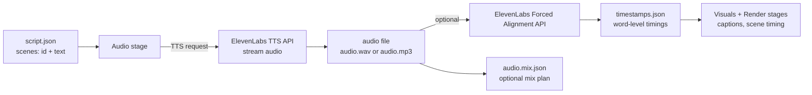
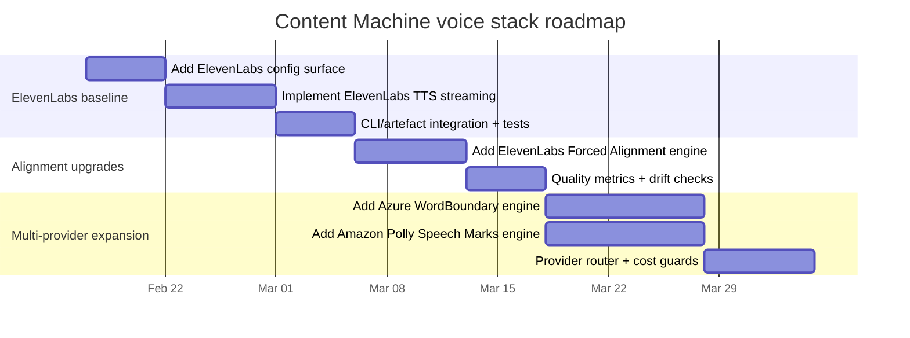

# Integrating ElevenLabs and Comparable Voice AI into 45ck/content-machine

## Executive summary

Repository analysis (via the GitHub connector) indicates that **45ck/content-machine** is a **TypeScript/Node.js CLI** for automated short-form video generation organised as a staged pipeline: **script → audio → visuals → render**, with intermediate artefacts (e.g., `script.json`, `audio.wav`, `timestamps.json`, `visuals.json`) and a configuration surface that already includes **TTS engine selection** and **word-level timestamping** as a first-class concern (notably for captions and scene timing). This makes the codebase structurally well-suited to add **additional TTS/voice providers** as pluggable engines, plus optional cloud-based alignment to reduce reliance on local ASR.

For ElevenLabs specifically, the integration opportunity is broader than “premium TTS + voice cloning”:

- ElevenLabs supports **streaming TTS** over HTTP chunked transfer encoding. citeturn2view3
- ElevenLabs exposes an endpoint to **create an Instant Voice Clone** (`POST /v1/voices/add`) using uploaded sample files. citeturn2view2
- ElevenLabs provides **voice settings** (stability, similarity boost, style, speed, speaker boost) and endpoints to read/update them, allowing consistent “brand voice” tuning across runs. citeturn14search3turn14search6turn14search2
- ElevenLabs offers **character-level alignment** for TTS via “with timestamps” streaming endpoints (returned as alignment arrays), and also offers an explicit **Forced Alignment API** returning **word-level timings** (`POST /v1/forced-alignment`). citeturn8search3turn10search1turn10search0
- ElevenLabs publishes **plan-based concurrency limits** for Text-to-Speech, which should directly inform your job queue sizing and retry behaviour. citeturn1search8turn2view6
- ElevenLabs documents **voice cloning restrictions** and safety controls (eg, restrictions around impersonation of political figures plus broader prohibited-use constraints), which must be baked into UI/UX and governance if you expose cloning to end users. citeturn1search1turn0search4turn2view5

For “similar tools worth integrating”, the highest-leverage additions for Content Machine are those that natively emit **timing metadata** (word boundaries / speech marks), because the product depends on tight caption timing and scene alignment:

- **Azure Speech** provides **WordBoundary events** (word/punctuation/sentence) with audio offsets and durations. citeturn23search1turn23search0
- **Amazon Polly** provides **Speech Marks** as line-delimited JSON with millisecond timing for words/sentences/visemes/SSML marks, and explicitly bills Speech Marks like speech output. citeturn21search5turn21search0
- **Google Cloud Text-to-Speech** supports **SSML timepoints** via `<mark>` and returns timestamps, but it is not “free word-level boundaries” unless you inject marks at word granularity (which increases request size and complexity). citeturn21search6turn21search2

A pragmatic roadmap is:

1. **Add ElevenLabs as a TTS engine** (including voice settings + streaming).
2. **Add ElevenLabs alignment path** (Forced Alignment first, with optional TTS “with timestamps” as alternative).
3. Add at least one “native word timing” provider (**Azure Speech or Amazon Polly**) as an engine option to improve timestamp quality and reduce ASR dependence.
4. Add orchestration primitives (caching, batching, concurrency caps, cost guards, monitoring) that work across all providers.

## Content Machine architecture relevant to voice, TTS, and content generation

This section is based on direct inspection of the **45ck/content-machine** repository via the GitHub connector (the repository does not appear indexable by public web search at the time of writing, so these repo-specific statements are not accompanied by web citations).

The project is a **CLI-first, staged generation pipeline**:

- **Script stage** produces structured script artefacts (scenes with narration text and visual direction).
- **Audio stage** generates a **voiceover audio file** (and optionally an audio-mix plan for background music/SFX/ambience) plus a **timestamps artefact** intended for caption timing and downstream alignment.
- **Visuals stage** matches/produces scene assets.
- **Render stage** produces final video output using the artefacts (audio, timestamps, visuals).

Key components relevant to integrating external voice/TTS:

- A central **configuration system** already includes an `audio.ttsEngine` choice (currently supporting at least two engines) and an ASR choice for timestamps.
- A schema-driven artefact contract for audio and timestamps includes fields like `ttsEngine`, `asrEngine`, total duration, and word-level timing structures.
- The “generate” command can accept pre-existing external artefacts (`--audio`, `--timestamps`) to skip stages, implying clean stage boundaries and making it straightforward to integrate “remote TTS” as another engine.

Architectural unknowns / unspecified from repository material available through the connector:

- Whether there is an existing “provider router” abstraction for audio comparable to visuals provider routing (there is clear routing for visuals; parity for audio may be partial).
- Whether there is an existing storage layer beyond local filesystem (the CLI is artefact-based; backend storage/CDN is not clearly part of the repo’s core runtime).

Implication: integrating ElevenLabs is best treated as adding a **new TTS provider module** plus optional **alignment provider module**, with minimal disruption to existing pipeline stages and artefact schemas.

## ElevenLabs capability map to Content Machine integration points

This section maps ElevenLabs features to concrete integration points, data flows, operational constraints, and API call sequences.

### Feature-to-module mapping

**High-quality TTS (Text-to-Speech)**

- ElevenLabs provides streaming TTS over HTTP chunked transfer encoding, and official SDK examples show how to stream audio in Node/TypeScript. citeturn2view3
- The Text-to-Speech streaming endpoint is `POST /v1/text-to-speech/:voice_id/stream`, with parameters like `output_format`, `model_id`, `language_code`, `voice_settings`, and normalisation controls. citeturn4view0

**Naturalness continuity controls (stitching / context)**

- The same endpoint supports `previous_text` / `next_text` and `previous_request_ids` / `next_request_ids` to improve continuity across split generations (useful if Content Machine chunks long scripts). citeturn4view0

**Voice cloning**

- Instant Voice Cloning: `POST /v1/voices/add` with multipart audio samples. citeturn2view2
- The response includes `voice_id` and whether verification is required. citeturn2view2

**Voice settings management**

- Read default voice settings: `GET /v1/voices/settings/default`. citeturn14search2
- Read settings for a specific voice: `GET /v1/voices/:voice_id/settings`. citeturn14search3
- Update settings: `POST /v1/voices/:voice_id/settings/edit`. citeturn14search6

**Streaming**

- ElevenLabs describes streaming audio for select endpoints, returning raw audio bytes via chunked transfer encoding; Node SDK examples are provided. citeturn2view3
- You should treat this as a way to reduce peak memory and time-to-first-byte, but still persist output deterministically as a file artefact.

**SSML support**

- For WebSocket-based TTS, ElevenLabs documents an `enable_ssml_parsing` query parameter. citeturn12search2turn12search0
- For Content Machine’s “offline render pipeline” the simplest first step is to keep narration as plain text; SSML support becomes valuable when you introduce automated prosody controls (pauses, emphasis, pronunciation dictionaries).

**Timestamps / alignment**

- ElevenLabs “with timestamps” streaming endpoints return alignment arrays (character-level timing) plus a “normalised alignment”. citeturn8search3turn3view2
- ElevenLabs Forced Alignment returns **word-level** timings and an overall loss score: `POST /v1/forced-alignment` with audio file + transcript text. citeturn10search1turn10search0
- ElevenLabs additionally provides “Text to Dialogue stream with timestamps” which returns:
  - `audio_base64` chunks,
  - `alignment` and `normalized_alignment` character arrays with start/end times,
  - `voice_segments` with per-input segment timing and index ranges. citeturn3view2  
    This is unusually well-matched to Content Machine’s “scene-based script” because each scene can be an input, yielding explicit segment boundaries.

**Pricing and utilisation constraints**

- ElevenLabs pricing is credit-based and plan-tiered, with included credits and features like Instant Voice Cloning (Starter+) and Professional Voice Cloning (Creator+). citeturn0search3turn13search2
- Concurrency limits for TTS depend on plan and model family (eg, higher limits for flash/turbo). citeturn1search8turn2view6
- Data retention controls exist (eg, “zero retention mode” noted as enterprise-only in the TTS endpoint documentation via `enable_logging=false`). citeturn4view0

**Legal / ethical constraints**

- ElevenLabs states there are restrictions around what voices can be uploaded for cloning and references their terms and prohibited-use policy. citeturn0search4turn2view5
- ElevenLabs describes additional “no-go voices” safeguards for voices approximating certain political figures (notably US/UK election related). citeturn1search1
- ElevenLabs says users can opt out of data use intended to improve models via account settings, with different default behaviour for enterprise. citeturn0search5

### Integration design choices

Content Machine’s audio stage needs two outputs:

1. **voiceover audio** (`.wav` or `.mp3`, eventually rendered/mixed)
2. **word-level timestamps** aligned to the narration for captions and scene timing

ElevenLabs offers three viable timestamp strategies:

#### Strategy A: TTS → Forced Alignment (recommended for correctness-first)

- Generate audio using standard TTS streaming (`/text-to-speech/:voice_id/stream`). citeturn4view0
- Run `POST /v1/forced-alignment` with:
  - the generated audio file
  - the _exact transcript text you intended_ (ideally after any normalisation rules you apply)  
    Output includes `words[]` with `start`/`end` times. citeturn10search1turn10search0

Why this fits Content Machine:

- Your internal timestamps schema is word-based; forced alignment is word-based.
- Forced alignment can also be used for **other** TTS engines (including your current local engine), giving you a path to unify alignment quality without Whisper.

Operational implications:

- Two sequential API calls per audio artefact (TTS + alignment).
- More cost, but removes local ASR dependency and should have more deterministic alignment quality than ASR-on-generated-audio.

#### Strategy B: “Text to Dialogue stream with timestamps” (recommended for scene-aware generation)

Use `POST /v1/text-to-dialogue/stream/with-timestamps` where **each script scene is an input** with a voice ID. citeturn3view2

This yields:

- audio chunks (base64)
- `voice_segments` mapping each input to a start/end time plus character index ranges
- per-character timing arrays for the whole output and the normalised output. citeturn3view2

Why this fits Content Machine:

- It directly yields **segment boundaries** per scene input, matching your `SceneTimestamp` concept.
- You can derive word timings by grouping character timings between word delimiters within each segment range.

Trade-offs:

- Alignment is character-based, not word-based; you must implement robust “character→word” aggregation and handle normalised alignment differences.
- Streaming payload is JSON blobs (base64 audio), which is slightly more complex to persist than raw bytes. citeturn3view2

#### Strategy C: “Stream speech with timing” (character-level timestamps)

ElevenLabs documents a TTS “with timestamps” stream that returns alignment arrays describing when each character was spoken. citeturn8search3turn7search0

This can work for single-voice narration without dialogue segmentation, but you would still need to map alignment to scenes (unless you generate scene-by-scene and concatenate).

### Recommended low-risk integration approach

- Implement **ElevenLabs TTS** using `POST /v1/text-to-speech/:voice_id/stream` to a file (mp3 or wav/pcm depending on plan). citeturn4view0turn0search3
- Implement **ElevenLabs Forced Alignment** as an _optional alignment engine_ that can replace or complement local Whisper timestamping. citeturn10search1turn10search0
- Optionally, add **Text-to-Dialogue** mode for advanced per-scene timing without a second call, once you are ready to harden normalisation + char→word mapping. citeturn3view2

### Data flow and artefact flow



### Authentication and secret management

ElevenLabs uses API keys via the `xi-api-key` header; ElevenLabs recommends not exposing it in client-side code and notes keys can be scoped and quota-limited. citeturn11search0

For Content Machine (CLI and/or backend), the secure baseline is:

- Store the API key as an environment variable (eg `ELEVENLABS_API_KEY`) in `.env` for local use, and as a secret in your deployment environment.
- If generating audio directly from a browser/client (not typical for the current CLI), use **single-use tokens** rather than shipping the API key. citeturn11search0

### Latency, throughput, scalability, and rate limits

ElevenLabs provides plan-based **concurrent request limits** for Text to Speech, and distinguishes “Flash/Turbo models” vs “other models”. citeturn1search8turn2view6

Practical design implications for Content Machine:

- Implement a **provider-aware concurrency limiter** (token bucket or semaphore) sized to the account plan and model choice.
- For multi-video batching (CI runs or back-office jobs), enforce:
  - maximum parallel jobs per provider,
  - exponential backoff on `429` and transient 5xx,
  - request splitting with continuity controls (previous/next text or request id stitching) when scripts exceed practical length. citeturn4view0turn1search8

### Error handling requirements

ElevenLabs endpoints document `422 Unprocessable Entity` for invalid requests (likely validation errors, wrong model/voice mismatch, unsupported output format, etc.). citeturn2view2turn4view0turn10search1

For robust Content Machine runs:

- Treat 4xx as **non-retryable** except `429` (rate/concurrency).
- Treat 5xx + network errors as retryable with capped exponential backoff.
- For streaming endpoints, detect partial streams and:
  - fail-fast with a clear error code, or
  - resume by regenerating that segment (for chunked/scene-based generation).
- Persist structured error metadata into the artefact envelope (so `cm generate` can tell you “audio failed due to quota” vs “voice id not found”).

### Sample ElevenLabs API call sequences

**Sequence: single narration generation + forced alignment**

1. `GET /v1/voices` (or voices search endpoint) to validate `voice_id` exists, if you want preflight checks. citeturn15search7turn15search5
2. `POST /v1/text-to-speech/:voice_id/stream` → stream audio to file. citeturn4view0turn2view3
3. `POST /v1/forced-alignment` with `{ file: audio, text: transcript }` → word timings. citeturn10search1
4. Write `timestamps.json` using your internal schema, where:
   - `ttsEngine = "elevenlabs"`
   - `asrEngine = "elevenlabs-forced-alignment"`
   - store `loss` and per-word `loss` as optional metadata (or incorporate into a debug section). citeturn10search1

**Sequence: per-scene dialogue generation with segment boundaries**

1. Build `inputs[] = [{ text: scene.text, voice_id }, ...]`
2. `POST /v1/text-to-dialogue/stream/with-timestamps`
3. Append decoded `audio_base64` chunks into a single audio buffer/file
4. Build per-scene word timings by slicing alignment arrays using `voice_segments[].character_start_index/end_index` and grouping characters into words within each segment. citeturn3view2

## Implementation plan with prioritised milestones, effort, skills, and risks

### Milestones



### Effort estimates and skill requirements

**Add ElevenLabs TTS (streaming) — effort: Medium**

- Skills: TypeScript/Node streams, HTTP client design, CLI wiring, test doubles for external APIs.
- Main risks:
  - Managing streaming writes robustly (partial stream failures).
  - Model/output_format constraints per plan (eg, 192kbps and PCM gating by subscription tier). citeturn0search3turn4view0

**Add ElevenLabs Forced Alignment — effort: Medium**

- Skills: multipart uploads, audio file handling, schema conversion (vendor→internal timestamp schema).
- Main risks:
  - Text normalisation mismatch between what was synthesised vs what you align against; mitigate by preserving the “exact sent text” alongside artefacts and aligning against that.
  - Cost: Forced Alignment is priced like Speech-to-Text. citeturn13search0

**Add Azure word boundary integration — effort: Medium to High**

- Skills: Azure Speech SDK usage from Node, event-driven APIs, SSML handling.
- Main risks:
  - SDK packaging and native dependencies in Node environments.
  - Auth and region handling; operational differences between server and local machines.
- Value:
  - WordBoundary events include audio offsets/durations and boundary types, giving near-native word timings. citeturn23search1turn23search0

**Add Amazon Polly speech marks integration — effort: Medium**

- Skills: AWS SDK, IAM, streaming, handling line-delimited JSON.
- Main risks:
  - Two-call pattern (or multi-output pattern) to get audio + marks; ensure consistent input text and configuration across calls.
- Value:
  - Polly speech marks include `time` ms from start, `type` (word/sentence/viseme/ssml), and offsets into input text. citeturn21search5
  - Pricing explicitly allows caching and bills speech marks similarly to synthesized speech. citeturn21search0

### Cross-cutting risks

- **Content moderation / misuse**: If you expose voice cloning to end users, you need a hard “consent + rights” policy plus enforcement, reflecting vendor restrictions and your own risk posture. citeturn0search4turn2view5turn1search1
- **Vendor API drift**: Provider endpoints and parameters evolve (eg, quality parameter additions, new alignment features). Plan for internal versioning and feature flags. citeturn11search9turn10search7
- **Lock-in**: Implement an internal provider abstraction so Content Machine can swap TTS and alignment engines without rewriting the pipeline.

## Comparative table of voice/TTS providers for Content Machine

The table prioritises: **voice quality**, **timestamp metadata availability**, **streaming**, **custom voice/cloning**, and operational constraints relevant to Content Machine.

| Provider                                                            | Key features                                                            | Pricing model                                                                                                                                                     | API capabilities                                                                                                              | Voice quality (practical)                                 | Latency/streaming                                                                                 | Custom voice / cloning                                                                               | Legal/usage restrictions                                                                                           | Recommended use-case in Content Machine                                                                         |
| ------------------------------------------------------------------- | ----------------------------------------------------------------------- | ----------------------------------------------------------------------------------------------------------------------------------------------------------------- | ----------------------------------------------------------------------------------------------------------------------------- | --------------------------------------------------------- | ------------------------------------------------------------------------------------------------- | ---------------------------------------------------------------------------------------------------- | ------------------------------------------------------------------------------------------------------------------ | --------------------------------------------------------------------------------------------------------------- |
| ElevenLabs                                                          | Premium TTS; streaming; voice settings; voice cloning; forced alignment | Credit-based plans; cloning features depend on plan tier citeturn0search3turn13search2                                                                        | TTS streaming endpoint; alignment endpoints (character-level and forced alignment) citeturn4view0turn10search1turn3view2 | High (widely used creator-grade) citeturn2view4        | Streaming supported; concurrency limits by plan citeturn2view3turn1search8                    | IVC voice creation endpoint; voice settings read/update citeturn2view2turn14search6              | Prohibited use policy + “no-go voices” safeguard; cloning restrictions citeturn2view5turn1search1turn0search4 | **Premium single-narrator voiceovers** + optional cloud alignment to simplify timestamping                      |
| entity["company","Microsoft Azure","cloud platform"] Speech      | Neural TTS; SSML; WordBoundary events; batch synthesis                  | Per-character billing; free tier noted citeturn22search1                                                                                                       | Speech SDK provides WordBoundary events with offsets/duration citeturn23search1turn23search0                              | High (broadcast-style neural voices) citeturn23search1 | Streaming via SDK audio chunks; WordBoundary emitted as synthesis progresses citeturn23search1 | Custom/PV voices exist but pricing/eligibility varies citeturn22search4                           | Standard Microsoft/Azure responsible use constraints (provider-specific; verify for your org) citeturn23search1 | **Best-in-class timestamps** without extra ASR; ideal when captions must be extremely tight                     |
| entity["company","Amazon Web Services","cloud platform"] (Polly) | TTS with Speech Marks (word/sentence/viseme/SSML marks)                 | Pay per character; standard vs neural vs long-form vs generative; Speech Marks billed similarly and caching explicitly allowed citeturn21search0turn21search5 | Speech Marks returned as line-delimited JSON; includes ms timing from start citeturn21search5                              | Good to high (varies by voice class) citeturn21search0 | Audio generation supported; speech marks can be requested citeturn21search5                    | No “voice cloning” in the ElevenLabs sense; voice inventory is provider-defined citeturn21search0 | Standard AWS acceptable use constraints; IAM security is critical                                                  | **Cost-effective deterministic timestamps** via Speech Marks; good default for scalable batch jobs              |
| entity["company","Google Cloud","cloud platform"] Text-to-Speech | SSML; timepoints via `<mark>`; newer TTS models                         | Per-character; SSML tags count (except `<mark>`), pricing depends on model tier citeturn21search2turn21search6                                                | Enables timepoints with `<mark>` and `SSML_MARK` timepointing citeturn21search6                                            | Good to high (voice-specific)                             | Supports timepoints; streaming features depend on API mode; verify per model                      | No direct “voice cloning”; custom voice offerings vary                                               | Standard cloud policy constraints                                                                                  | **Phrase-level timing** and multilingual coverage; less ideal for word-level captions unless you add many marks |
| entity["company","Resemble AI","voice ai company"]               | TTS; voice cloning; deepfake detection; enterprise/on-prem options      | Pay-as-you-go “Flex” + enterprise; per-second usage rates shown citeturn24search0turn24search1                                                                | Full API access claimed; deepfake detection access listed citeturn24search0                                                | Likely strong; validate with internal A/B                 | Some providers support low-latency WebSockets (verify in product docs)                            | Voice cloning capabilities marketed citeturn24search0turn24search1                               | Vendor governance likely strong due to anti-deepfake positioning citeturn24search1                              | **Secondary candidate** if you want integrated deepfake detection in workflow; requires deeper API-doc review   |
| entity["company","Replica Studios","voice ai company"]           | TTS API marketed for production pipelines; SSML shown in examples       | Pricing not confirmed from primary sources in this research (third-party pricing claims exist; treat as unverified) citeturn24search2                          | Example payload shows SSML usage and voice recipe concepts citeturn24search4                                               | Often used in games/characters; validate internally       | Streaming capabilities not confirmed here                                                         | Voice lab / recipe concepts implied citeturn24search4                                             | Must review provider terms for cloning/impersonation                                                               | **Niche candidate** for character voice packs; not recommended until primary pricing/docs are reviewed          |
| entity["organization","Coqui","open-source TTS project"] (TTS)   | Open-source TTS toolkit; many models; self-host possible                | MPL-2.0 in referenced repo fork (licence constraints matter) citeturn24search3                                                                                 | Self-host; model-dependent features                                                                                           | Variable by model                                         | Streaming depends on your serving layer                                                           | Some models support cloning in ecosystem, but not uniform; verify per model                          | Open-source licensing and model licence constraints must be reviewed                                               | **Offline/self-host** alternative where data residency is strict; evaluate licensing + ops cost                 |

## Concrete integration steps and Node.js call patterns

Repository language is TypeScript/Node.js, so the snippets assume a Node server module or CLI module.

### ElevenLabs integration steps

1. Add config keys:

- `audio.ttsEngine = "elevenlabs"`
- `audio.elevenlabs.voiceId`
- `audio.elevenlabs.modelId`
- `audio.elevenlabs.outputFormat`
- optional: `audio.elevenlabs.voiceSettings` (stability, similarity_boost, style, speed, speaker boost)

2. Add secret handling:

- `ELEVENLABS_API_KEY` in environment; pass in `xi-api-key`. citeturn11search0

3. Implement TTS:

- Default: `POST /v1/text-to-speech/:voice_id/stream` and stream response bytes to file. citeturn4view0turn2view3

4. Implement timestamps:

- Recommended: `POST /v1/forced-alignment` and map `words[]` to Content Machine timestamp schema. citeturn10search1

5. Add preflight checks:

- Validate concurrency caps using your stored plan limits (or configurable semaphore); ElevenLabs publishes plan concurrency guidance. citeturn1search8turn2view6

**Node.js pseudocode: ElevenLabs streaming TTS to file**

```ts
import fs from 'node:fs';
import { pipeline } from 'node:stream/promises';

type ElevenLabsVoiceSettings = {
  stability?: number;
  similarity_boost?: number;
  style?: number;
  speed?: number;
  use_speaker_boost?: boolean;
};

export async function elevenlabsTtsToFile(opts: {
  apiKey: string;
  voiceId: string;
  text: string;
  modelId?: string;
  outputFormat?: string; // e.g. "mp3_44100_128"
  voiceSettings?: ElevenLabsVoiceSettings;
  outPath: string;
}) {
  const url = `https://api.elevenlabs.io/v1/text-to-speech/${encodeURIComponent(
    opts.voiceId
  )}/stream`;

  const res = await fetch(url, {
    method: 'POST',
    headers: {
      'xi-api-key': opts.apiKey,
      'content-type': 'application/json',
    },
    body: JSON.stringify({
      text: opts.text,
      model_id: opts.modelId ?? 'eleven_multilingual_v2',
      output_format: opts.outputFormat ?? 'mp3_44100_128',
      voice_settings: opts.voiceSettings ?? undefined,
    }),
  });

  if (!res.ok || !res.body) {
    const errText = await res.text().catch(() => '');
    throw new Error(`ElevenLabs TTS failed: ${res.status} ${res.statusText} ${errText}`);
  }

  await pipeline(res.body as any, fs.createWriteStream(opts.outPath));
  return { audioPath: opts.outPath };
}
```

**Node.js pseudocode: ElevenLabs forced alignment**

```ts
import fs from 'node:fs';
import FormData from 'form-data';

export type ForcedAlignmentWord = {
  text: string;
  start: number;
  end: number;
  loss?: number;
};

export async function elevenlabsForcedAlignment(opts: {
  apiKey: string;
  audioPath: string;
  transcriptText: string;
}): Promise<{ words: ForcedAlignmentWord[]; loss: number }> {
  const form = new FormData();
  form.append('file', fs.createReadStream(opts.audioPath));
  form.append('text', opts.transcriptText);

  const res = await fetch('https://api.elevenlabs.io/v1/forced-alignment', {
    method: 'POST',
    headers: {
      'xi-api-key': opts.apiKey,
      ...form.getHeaders(),
    },
    body: form as any,
  });

  if (!res.ok) {
    const errText = await res.text().catch(() => '');
    throw new Error(
      `ElevenLabs forced alignment failed: ${res.status} ${res.statusText} ${errText}`
    );
  }

  const json = (await res.json()) as { words: ForcedAlignmentWord[]; loss: number };
  return json;
}
```

### Azure Speech integration steps

1. Add config keys:

- `audio.ttsEngine = "azure"`
- `audio.azure.key`, `audio.azure.region` via env secrets
- `audio.azure.voiceName` (eg `en-GB-…Neural`)

2. Use Speech SDK:

- Subscribe to `wordBoundary` event to accumulate timings. citeturn23search1turn23search0

3. Produce artefacts:

- audio output file from SDK
- timestamps built from boundary events

**Node.js sketch: WordBoundary event capture**

```ts
import * as sdk from 'microsoft-cognitiveservices-speech-sdk';
import fs from 'node:fs';

type WordTiming = { word: string; startMs: number; endMs: number };

export async function azureTtsWithWordBoundaries(opts: {
  key: string;
  region: string;
  voiceName: string;
  ssml: string;
  outPath: string;
}) {
  const speechConfig = sdk.SpeechConfig.fromSubscription(opts.key, opts.region);
  speechConfig.speechSynthesisVoiceName = opts.voiceName;

  const audioConfig = sdk.AudioConfig.fromAudioFileOutput(opts.outPath);
  const synthesizer = new sdk.SpeechSynthesizer(speechConfig, audioConfig);

  const timings: WordTiming[] = [];

  synthesizer.wordBoundary = (_s: any, e: any) => {
    // Azure reports offsets in ticks (100 ns). Convert to ms.
    const startMs = Math.round(e.audioOffset / 10000);
    const durMs = typeof e.duration === 'number' ? e.duration : 0;
    timings.push({
      word: e.text,
      startMs,
      endMs: startMs + Math.round(durMs / 10000),
    });
  };

  await new Promise<void>((resolve, reject) => {
    synthesizer.speakSsmlAsync(
      opts.ssml,
      (result: any) => {
        if (result.reason === sdk.ResultReason.SynthesizingAudioCompleted) resolve();
        else reject(new Error(result.errorDetails ?? 'Azure TTS cancelled'));
        synthesizer.close();
      },
      (err: any) => {
        synthesizer.close();
        reject(err);
      }
    );
  });

  return { audioPath: opts.outPath, timings };
}
```

### Amazon Polly integration steps

1. Add config keys:

- `audio.ttsEngine = "polly"`
- `audio.polly.voiceId`, `audio.polly.engine` (standard/neural/etc), `audio.polly.region`

2. Generate audio and speech marks:

- Polly Speech Marks are line-delimited JSON with `time` in ms and `type` including `word`; offsets reference the input string. citeturn21search5

3. Convert to timestamps:

- Word timings from `time` plus next word time (or estimate end time); for higher quality you can also request sentence marks.

4. Cost tracking:

- Polly bills by characters for speech or speech marks, and explicitly notes caching/replay is allowed at no extra cost. citeturn21search0

**Node.js sketch (AWS SDK v3 style)**

```ts
import { PollyClient, SynthesizeSpeechCommand } from '@aws-sdk/client-polly';
import fs from 'node:fs';

type PollyWordMark = { time: number; type: string; value: string };

export async function pollyTtsAndMarks(opts: {
  region: string;
  voiceId: string;
  text: string;
  outAudioPath: string;
}) {
  const polly = new PollyClient({ region: opts.region });

  // 1) Audio
  const audioRes = await polly.send(
    new SynthesizeSpeechCommand({
      Text: opts.text,
      OutputFormat: 'mp3',
      VoiceId: opts.voiceId as any,
    })
  );

  const audioBytes = await audioRes.AudioStream?.transformToByteArray();
  if (!audioBytes) throw new Error('Polly audio stream missing');
  fs.writeFileSync(opts.outAudioPath, Buffer.from(audioBytes));

  // 2) Speech marks (word)
  const marksRes = await polly.send(
    new SynthesizeSpeechCommand({
      Text: opts.text,
      OutputFormat: 'json',
      SpeechMarkTypes: ['word'],
      VoiceId: opts.voiceId as any,
    })
  );

  const marksBytes = await marksRes.AudioStream?.transformToByteArray();
  if (!marksBytes) throw new Error('Polly marks stream missing');

  const lines = Buffer.from(marksBytes).toString('utf-8').trim().split('\n');
  const marks = lines.map((l) => JSON.parse(l)) as PollyWordMark[];

  return { audioPath: opts.outAudioPath, marks };
}
```

### Google Cloud Text-to-Speech integration steps

1. Add config keys:

- `audio.ttsEngine = "gcp"`
- service account credentials or workload identity

2. Use SSML + `<mark>` for timepoints:

- Google returns timepoints for marks if you enable `SSML_MARK` timepointing. citeturn21search6

3. Practical approach:

- Use marks at **scene boundaries** rather than words (cheaper and simpler), because SSML tags (except `<mark>`) count toward billable characters. citeturn21search2turn21search6

## Orchestration recommendations for caching, batching, cost, monitoring, and A/B testing

### Caching and artefact determinism

**Goal:** avoid paying twice for the same narration text and voice configuration.

- Cache key should include: provider + model + voice ID + voice settings + normalisation settings + _exact transcript text_.
- Store audio in object storage (or local cache for CLI) and reuse if artefact already exists.
- When using providers that explicitly allow caching and replay without extra cost (Polly notes this), caching becomes a first-order cost control. citeturn21search0

### Batching and pre-rendering

- For provider limits, respect concurrency caps (ElevenLabs provides plan caps). citeturn1search8turn2view6
- Batch mode for long content:
  - Split by scene or section, generate segments, then concatenate deterministically.
  - For ElevenLabs, use continuity controls (`previous_text`, request-id stitching) when splitting. citeturn4view0
- Pre-render frequently-used intros/outros (hooks/CTAs) as cached audio segments.

### CDN distribution

If Content Machine evolves into a service:

- Upload final `audio.wav/mp3` and `video.mp4` to an object store.
- Use CDN URLs for playback, keeping raw provider outputs private.
- For user-specific voices, consider per-user buckets/prefixes + short-lived URLs.

### Cost controls

- **Hard caps**: stop generation once estimated cost exceeds threshold.
- ElevenLabs is credit-based; their help centre explains character-to-credit mapping for some models (e.g., one character equals one credit for certain models). citeturn13search8turn13search9
- Polly pricing is per million characters and differs by voice class; Speech Marks also count. citeturn21search0turn21search5
- Ensure your artefacts include:
  - estimated character count
  - actual provider usage values when available
  - per-video “voice cost” for budgeting and regression detection

### Monitoring and A/B testing of voices

- Implement cohort assignment:
  - `voice_variant = hash(userId or projectId) % N`
- Track:
  - completion time
  - render success rate
  - engagement (watch time, retention curve)
  - caption accuracy proxy (alignment loss from forced alignment; or word coverage metrics if you keep ASR checks) citeturn10search1

Suggested dashboards:

- **Latency dashboard**: p50/p95 TTS time, alignment time, render time.
- **Reliability dashboard**: error rate by provider / endpoint; retry counts; rate limit hits.
- **Cost dashboard**: credits or $/minute; cost per completed video; cache hit rate.
- **Quality dashboard**: alignment loss distribution (ElevenLabs forced alignment), word boundary completeness, caption drift warnings. citeturn10search1turn23search1

## Security, privacy, and compliance considerations

### Consent and voice cloning governance

- ElevenLabs explicitly indicates restrictions on what voices can be uploaded for cloning and ties expectations to terms and prohibited-use policy. citeturn0search4turn2view5
- ElevenLabs describes “no-go voices” safeguards to prevent cloning of certain political figures as part of anti-misinformation measures. citeturn1search1

For Content Machine, the safe baseline is:

- Require explicit confirmation that the user has rights/consent to clone the voice.
- Maintain an audit log (who created the voice, when, proof-of-consent reference, which samples were used).
- Provide an internal “voice removal” workflow (delete voice + delete cached outputs + revoke access).

### Data retention and model training opt-outs

- ElevenLabs states that some data may be used to improve models, with an opt-out mechanism and different defaults for enterprise. citeturn0search5
- ElevenLabs also mentions a “zero retention mode” for TTS requests via `enable_logging=false`, noted as enterprise-only in the TTS stream endpoint docs. citeturn4view0

Content Machine should therefore:

- Treat voice samples (cloning inputs) as highly sensitive; store locally only when required and minimise retention time.
- Store only derived identifiers (voice_id) unless you must keep samples for compliance.
- If your user base includes regulated customers, evaluate enterprise options that support stronger retention guarantees.

### GDPR/UK GDPR and CCPA alignment for voice data

Voice data can be biometric and therefore sensitive under data protection regimes in many contexts. UK ICO guidance notes that biometric data is personal information and that **explicit consent is likely** to be the most appropriate condition for processing special category biometric data. citeturn25search3turn25search5

For CCPA/CPRA, the California Attorney General’s office describes consumer rights including the right to know, delete, opt out of sale/sharing, correct, and limit use/disclosure of sensitive personal information. citeturn25search0

Practical compliance controls for Content Machine:

- Data inventory: track where voice samples, generated audio, transcripts, and voice IDs live.
- User rights endpoints (if you operate as a service): export/delete voice data and generated assets.
- Purpose limitation: avoid reusing samples for unrelated generation tasks.
- Security: encrypt at rest, restrict access by tenant/project, rotate API keys.

## Prioritised feature list to implement first

### Build-first features

**ElevenLabs TTS engine (streaming audio to artefact)**

- Rationale: immediate quality uplift and a clear integration surface; streaming reduces memory and is officially supported. citeturn2view3turn4view0

**Provider-wide concurrency limiter + retry policy**

- Rationale: ElevenLabs publishes concurrency limits by plan; ignoring them will cause avoidable failures. citeturn1search8turn2view6

**ElevenLabs Forced Alignment for timestamps**

- Rationale: produces word-level timings directly, aligning with Content Machine’s caption needs, and can reduce your dependency on local ASR infrastructure. citeturn10search1turn10search0

**Cost + cache instrumentation**

- Rationale: credit-based billing (ElevenLabs) and per-character billing (Azure/Polly/Google) demand guardrails; caching is the cheapest optimisation and is explicitly encouraged at least by Polly’s pricing model. citeturn21search0turn13search9

### Next-wave features

**Azure Speech engine with WordBoundary events**

- Rationale: native word boundary timing without an extra alignment call; very strong for caption sync. citeturn23search1turn23search0

**Amazon Polly engine with Speech Marks**

- Rationale: deterministic timestamps via speech marks, straightforward mapping to word-level caption timing. citeturn21search5turn21search0

**ElevenLabs Voice cloning workflow (IVC)**

- Rationale: powerful but high-governance; implement once consent + audit + deletion workflows exist. citeturn2view2turn0search4

## Primary sources used

ElevenLabs primary sources:

- Streaming support overview and SDK examples. citeturn2view3
- TTS streaming endpoint documentation. citeturn4view0
- Instant Voice Cloning creation endpoint (`/v1/voices/add`). citeturn2view2
- Voice settings endpoints. citeturn14search2turn14search3turn14search6
- Forced Alignment capability and endpoint. citeturn10search0turn10search1
- “Text to Dialogue stream with timestamps” response format (alignment + voice segment mapping). citeturn3view2
- Pricing and plan feature availability. citeturn0search3turn13search2
- Concurrency limits guidance. citeturn1search8turn2view6
- Prohibited use policy and cloning safeguards. citeturn2view5turn1search1turn0search4
- Data use and opt-out explanation. citeturn0search5

Alternative providers primary sources:

- Amazon Polly Speech Marks format. citeturn21search5
- Amazon Polly pricing. citeturn21search0
- Azure Speech synthesis WordBoundary events and example usage. citeturn23search1turn23search0
- Azure Speech pricing overview. citeturn22search1
- Google Cloud Text-to-Speech SSML timepoints (`<mark>`). citeturn21search6
- Google Cloud Text-to-Speech pricing. citeturn21search2

Privacy/compliance primary sources:

- CCPA consumer rights overview (California Attorney General). citeturn25search0
- UK ICO biometric data guidance (lawful processing and biometric data sensitivity). citeturn25search3turn25search5
