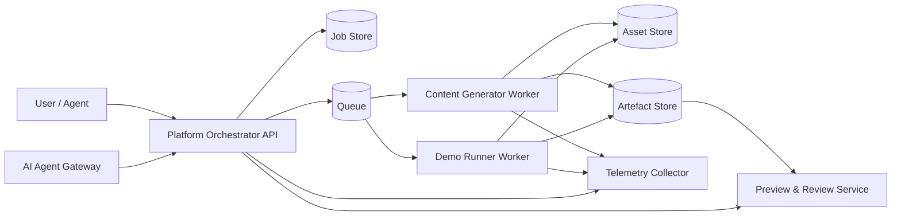
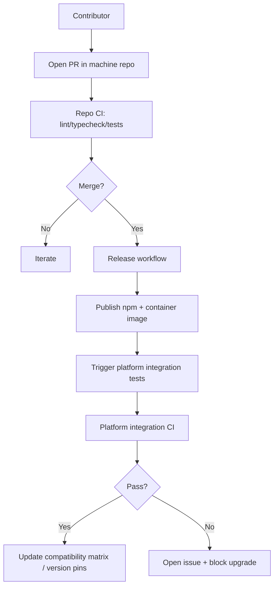

# Machine set specification for a platform integrating content-machine and demo-machine

## Executive summary

A useful “machine” model for your platform is: **an independently deployable capability unit** (worker/service/plugin) that declares (a) a **manifest**, (b) **stable job/request schemas**, (c) **deterministic artefact outputs**, and (d) standard **health/observability** behaviour. This aligns with long-standing modularisation guidance: decompose systems to hide likely-to-change design decisions behind stable interfaces, improving flexibility and comprehensibility. citeturn4search1turn4search7

Given the two existing repos (a CLI-first short-form video generator, and a “demo-as-code” browser automation + FFmpeg renderer), the most robust near-term integration strategy is **queue-driven workers** (run-to-completion jobs) producing artefacts into an object store, orchestrated by a platform control plane. Queue-based load levelling is a canonical way to handle bursty workloads and decouple intake from processing, which is particularly relevant to video generation and browser capture workloads. citeturn14search0turn3search4

Because both repos are currently at **0.x** versions, you should assume their public interfaces are **not yet stable** and explicitly define what counts as public API (CLI flags/output, schemas, service endpoints) before you scale the machine ecosystem. citeturn11search0

### Information needs

To recommend an actionable machine set (and prioritise it), these are the specific things that matter most:

1. **What is the “platform promise” and latency model?** Interactive (<5s) vs batch (minutes) strongly affects whether machines should be synchronous services or async workers. citeturn14search0turn3search4  
2. **Which parts of the two repos are already stable interfaces?** (CLI contracts, config surfaces, schemas, artefact layouts) and which are internal details likely to churn. citeturn11search0turn2search4  
3. **Operational constraints**: required system deps (Chromium, FFmpeg, fonts), expected CPU/RAM/ephemeral disk, and whether GPU acceleration is needed for any rendering path. citeturn0search0turn0search1  
4. **Your intended ecosystem posture**: internal-only machines vs third-party extensibility (plugin trust model, version gating, registry). This determines how strict your manifest and schema governance must be. citeturn4search1turn6search41  
5. **Observability and compliance requirements**: whether you need end-to-end traceability and signal correlation, and whether you will standardise on OpenTelemetry. citeturn14search2  

## What the existing repos already provide

This section enumerates what is present in each repo (interfaces, entrypoints, config, tests, CI, Docker). Where details are absent in the repos, they are stated as **unspecified**.

### Repos explicitly in scope

- `45ck/content-machine` (default branch: `master`; public repo).  
- `45ck/demo-machine` (default branch: `master`; public repo).

### content-machine: interfaces, entrypoints, config, tests, CI, Docker

**Interfaces and entrypoints (present)**  
The repository is explicitly **CLI-first**, exposing a `cm` command. The README documents an end-to-end `cm generate` flow and a staged pipeline that can be run step-by-step (script → audio/timestamps → visuals → render). The CLI has global flags intended to support automation (e.g., config path, JSON mode, offline mode, non-interactive “yes”), which is already close to a “machine contract” surface. (Repo inspection via GitHub connector; details are present in README and CLI entrypoint.)

The CLI entrypoint loads a large catalogue of subcommands including (not exhaustive): `mcp`, `config`, `doctor`, `demo`, `script`, `audio`, `visuals`, `media`, `render`, `assets`, `package`, `research`, `retrieve`, `validate`, `videospec`, `telemetry`, `generate`, plus quality/evaluation oriented commands. This breadth suggests two integration shapes:
- **one coarse-grained machine** (`content-machine` as a single worker), and/or
- **multiple finer-grained machines** aligned to pipeline stages and cross-cutting services (assets, research, telemetry, MCP gateway).

**Configuration (present)**  
The repo contains a strongly documented config surface with explicit file locations and precedence: CLI flags override `.env`, which overrides `.content-machine.toml`, which overrides defaults. It also establishes project-scoped (`./.cm/`) and user-scoped (`~/.cm/`) data directories. (Repo inspection via GitHub connector; details are present in generated config surface docs.)

**Secrets and environment variables (present)**  
`OPENAI_API_KEY` is required; many optional API keys are supported (e.g., additional LLM providers and media/search APIs). This implies you need a platform-level secrets model with machine-scoped secret injection (and likely “capability flags” per machine). (Repo inspection via GitHub connector; details are present in generated env var docs.)

**Tests (present)**  
The repo uses *Vitest* and includes unit tests and at least some end-to-end and Playwright-labelled tests (consistent with video and UI validation work). The presence of quality-gate scripts (docs linting, glossary checks, duplication checks) indicates a high emphasis on repository hygiene.

**CI/CD (present)**  
A CI workflow runs a wide “quality gates” suite: lint, typecheck, build, types build, tests with coverage, duplication and size checks, and uploads coverage. Release automation uses Release Please with additional logic to dispatch required checks for release PRs.

**Dockerfiles / containerisation (missing / unspecified)**  
No Dockerfile is present in the repo. Container build, runtime contracts, and health endpoints are therefore **unspecified** and must be added for a consistent machine ecosystem. Docker’s own documentation highlights `HEALTHCHECK` and other runtime instructions you can standardise on once images exist. citeturn0search0turn0search1

### demo-machine: interfaces, entrypoints, config, tests, CI, Docker

**Interfaces and entrypoints (present)**  
The repo is **also CLI-first**, exposing a `demo-machine` command with subcommands:
- `run <spec>`: full pipeline (capture + edit + narrate),
- `validate <spec>`,
- `capture <spec>`,
- `edit <events>`,
plus a `format <spec>` converter. (Repo inspection via GitHub connector; details are present in README and CLI entrypoint.)

**Spec schema and data contract (present)**  
A major advantage here is that demo-machine already defines its *spec format* as a Zod schema (meta, runner, redaction, pacing, chapters/steps). This is an excellent “machine contract nucleus” because it can be exported as JSON Schema, validated before execution, and versioned. JSON Schema’s Core spec frames JSON Schema as a media type for defining structure for validation/documentation/interaction control. citeturn2search4turn2search3

**Configuration (partially present)**  
The spec loader supports YAML, JSON, JSON5/JSONC, and TOML. Beyond that, machine-wide config files and precedence rules are **unspecified** (no equivalent of a repo-generated config surface doc surfaced).

**Runtime dependencies (present, operationally heavy)**  
The repo uses real browser automation and video rendering. This strongly suggests that containerisation and sandboxing will matter more here than for typical stateless services. Playwright’s documentation confirms that video recording is produced on browser context closure and can be configured; this informs how you design “capture artefacts” and lifecycle guarantees. citeturn12search1

**CI/CD (present)**  
A GitHub Actions CI workflow builds, lints, formats, typechecks, and runs tests on Node 22 with pnpm. A release workflow publishes to npm on “release published”.

**Dockerfiles / containerisation (missing / unspecified)**  
No Dockerfile is present. Given Chromium + FFmpeg requirements, this is a pressing gap for reliable platform integration. citeturn0search0turn0search1

## Machine model and platform-wide contracts

A machine ecosystem needs **a small number of standard contracts** that every component adheres to, even if implementation languages differ.

### Standard contracts to enforce across all machines

**Machine manifest**  
Every machine should ship a `machine.yaml` describing identity, version, interfaces, schemas, secrets, and resource profile. This is the “declared public API” for operational integration and must be SemVer-governed. SemVer explicitly requires declaring a public API and incrementing versions based on compatibility impact. citeturn11search0

**Job envelope and idempotency**  
To support queue-based orchestration and tolerate redelivery, define a platform job envelope:

- `jobId` (platform-generated), `machine`, `machineVersionRange` (optional), `idempotencyKey`,
- `request` (machine-specific payload; schema validated),
- `artifactsUriPrefix` (where outputs must land),
- `traceContext` (for correlation).

Most production queues are **at-least-once** unless you pay for stronger guarantees; Redelivery can happen and systems should tolerate duplicates. For example, Google Cloud Pub/Sub documents at-least-once delivery as the default and advises being tolerant to redeliveries; it also offers exactly-once delivery with constraints and trade-offs. citeturn13search0turn13search1turn13search5

Queue-based load levelling is the canonical architecture pattern for decoupling intake from processing and smoothing intermittent heavy loads, with explicit discussion of trade-offs like asynchronous responses and controlling processing rates. citeturn14search0

**Artefact contract**  
Every machine writes an `artifacts.json` manifest containing:
- logical names (`finalVideo`, `previewMp4`, `eventsLog`, `subtitlesSrt`, `debugBundle`),
- content types,
- URIs,
- checksums,
- provenance (machine name/version, input hash).

This keeps heavy outputs out of synchronous APIs and supports later preview/review workflows.

**Health checks and readiness**  
If machines run as services, implement standard HTTP health endpoints (`/healthz`, `/readyz`). If they use gRPC, expose the standard gRPC health service. Kubernetes describes how readiness/liveness/startup probes control scheduling and restarts; the probes have distinct semantics that map cleanly to “worker ready to accept jobs” vs “process alive”. citeturn1search1turn4search0turn3search4

**Observability and signal correlation**  
Standardise on structured logs and (ideally) OpenTelemetry. The OpenTelemetry logs spec emphasises consistent attribute enrichment and correlation across logs/traces/metrics through a collector pipeline. citeturn14search2

**Secrets**  
Machines should never embed secrets in images or code; inject at runtime. Kubernetes documents Secrets as a mechanism for managing sensitive values, while warning about default storage and access risks (important if you deploy into K8s). citeturn14search1

### Interface choices

You need at least one of these per machine, and often two:

- **Worker queue interface**: `consume(job)` → produce artefacts + status events. Best for heavy video workflows. citeturn14search0turn3search4  
- **HTTP/OpenAPI control surface**: submit job / query status / list artefacts. OpenAPI defines a language-agnostic interface description for HTTP APIs and is specifically designed to enable automation and tooling (docs generation, client/server generation, testing). citeturn1search2turn1search3  
- **gRPC internal service** (optional): useful for streaming progress/events and strong typing; gRPC’s health checking protocol is standardised (health/v1). citeturn4search0turn4search4turn4search6  

## Candidate machines to build

Below are **ten** candidate machines (≥8 as requested), covering orchestration, content generation, rendering, asset management, previewing, testing/sandboxing, telemetry, and AI agent orchestration. Each includes a specification-style description and **three concrete integration options**.

A consistent theme: start coarse-grained (one worker per repo) for MVP, then split into finer-grained machines as you scale.

### Platform Orchestrator Machine

**Purpose and responsibilities**  
Control plane that accepts user/agent requests, validates job schemas, assigns machine routing, manages retries/idempotency, and provides job status + artefact discovery.

**Inputs/outputs and data contracts**  
Input: `POST /jobs` with a platform job envelope. Output: job ID, status events, and an artefact index.

**Runtime dependencies and resource profile**  
CPU-light, stateful (job store). Needs database + queue broker. Resource: low CPU, medium memory, high availability.

**Suggested interfaces**  
OpenAPI for external API; worker queue for machine dispatch; optionally gRPC for internal streaming.

**Observability/health checks**  
`/healthz` (process alive), `/readyz` (connected to DB/queue), structured logs + OTel traces. citeturn1search1turn14search2

**Security/secrets**  
AuthN/AuthZ for job submission and artefact access; credentials for queue/DB/object store; optional per-tenant rate limits.

**Effort & priority**  
Effort: **High**. Priority: **P0** (platform cannot function without it).

**Integration options (3)**  
1) **Service (recommended)**: HTTP/OpenAPI + queue dispatch. Pros: central governance; clear UX. Cons: more infra. Effort: High. citeturn1search2turn14search0  
2) **Library inside main platform**: Pros: fastest to ship if platform already exists. Cons: harder to evolve as ecosystem grows. Effort: Medium. citeturn4search1turn6search41  
3) **Kubernetes-native controller**: Pros: strong operational semantics (Jobs, retries). Cons: K8s expertise required. Effort: High. citeturn3search4turn1search1  

### Content Generator Machine

**Purpose and responsibilities**  
High-level “topic → final short-form video” job. Initially, treat `content-machine` as a black-box worker running the existing end-to-end pipeline, producing a final MP4 plus artefacts.

**Inputs/outputs and data contracts**  
Input example:
- `topic`, `archetype`, `pipeline`, `outputProfile` (resolution/length), `keepArtifacts`.
Output:
- `finalVideo.mp4`, intermediate artefacts (script, timestamps, visuals plan, logs), `artifacts.json`.

**Runtime dependencies and resource profile**  
Node-based, heavy CPU during rendering, moderate RAM, significant disk I/O. May perform network calls (LLMs, media sources). Concurrency should be configurable.

**Suggested interfaces**  
Worker queue interface is primary; CLI wrapper as local dev surface; optional OpenAPI `runJob` for internal use.

**Observability/health checks**  
Structured logs (jobId/stage); periodic progress events; `--json` mode implies machine-readable outputs.

**Security/secrets**  
At minimum, LLM API key(s). Potentially multiple external API keys for media/search providers. Must support least-privilege injection.

**Effort & priority**  
Effort: **Medium** (wrap existing CLI into worker mode + Dockerfile). Priority: **P0** (core capability).

**Integration options (3)**  
1) **Container worker (recommended)**: isolate dependencies; run-to-completion jobs. Pros: reproducible; avoids platform Node dependency conflicts. Cons: build image size/time. Effort: Medium. citeturn0search1turn14search0  
2) **CLI subprocess from platform**: Pros: fastest MVP; minimal code changes. Cons: poor isolation; harder secrets mgmt/observability; requires local deps. Effort: Low. citeturn11search0  
3) **Library import (Node)**: Pros: best in-process ergonomics. Cons: coupling; dependency/Node version alignment risk. Effort: Medium. SemVer warns about dependency hell dynamics when many packages evolve. citeturn11search0  

### Content Stage Machines

These split the content pipeline into independently scalable units once needed.

**Purpose and responsibilities**  
Break out stages such as:
- Script generation machine (topic → script.json)  
- Audio/TTS machine (script → audio + timestamps)  
- Visual plan machine (timestamps → visuals.json)  
- Render machine (visuals + audio → MP4)  

This decomposition follows the general modularisation principle of isolating volatile decisions and scaling hotspots. citeturn4search1turn14search0

**Inputs/outputs and data contracts**  
Each stage consumes the previous stage’s artefact schema; outputs deterministic artefact manifests.

**Runtime dependencies and resource profile**  
Script/plan stages are network-bound (LLMs) and CPU-light. Render is CPU-heavy and may need large ephemeral storage.

**Suggested interfaces**  
Worker queue per stage. The platform orchestrator composes them into workflows.

**Observability/health checks**  
Per-stage progress events; stage-level metrics (duration, failure reasons).

**Security/secrets**  
Stage-specific keys (LLM for script/TTS; media keys for visuals/media retrieval).

**Effort & priority**  
Effort: **High** overall (requires refactoring + stable intermediate schemas). Priority: **P1** (scale phase).

**Integration options (3)**  
1) **Queue workers per stage (recommended for scale)**: Pros: throughput scaling; better retries. Cons: more queues/contracts. Effort: High. citeturn14search0turn3search4  
2) **Single monolithic worker with internal stages (MVP-friendly)**: Pros: simplest; fewer contracts. Cons: less scalable. Effort: Low–Medium. citeturn11search0  
3) **Service-per-stage (HTTP/gRPC)**: Pros: explicit contracts; potential streaming. Cons: operational overhead. Effort: Medium–High. citeturn1search2turn4search0  

### Asset Management Machine

**Purpose and responsibilities**  
Centralise acquisition, caching, licensing metadata, and normalisation of media assets (stock clips, fonts, logos, uploaded assets). Content generation and demo rendering both benefit from a unified asset pipeline.

**Inputs/outputs and data contracts**  
Input: asset requests (query, source, constraints, licence tags); Output: immutable asset objects + metadata (hash, licence, provenance) and cached URIs.

**Runtime dependencies and resource profile**  
Network-heavy; storage-heavy; CPU-light unless transcoding/thumbnails are included.

**Suggested interfaces**  
HTTP API for asset lookup/upload; worker jobs for heavy transforms (transcode, thumbnail). Artefact store integration.

**Observability/health checks**  
Per-provider error rates; cache hit ratio; object store latency.

**Security/secrets**  
Provider API keys; signed upload URLs; per-tenant access control.

**Effort & priority**  
Effort: **Medium–High**. Priority: **P1** (strong reuse potential).

**Integration options (3)**  
1) **Service + object store (recommended)**: Pros: shared across machines; strong governance. Cons: needs auth model. Effort: Medium–High. citeturn14search1turn2search4  
2) **Embedded inside each machine**: Pros: quickest short-term. Cons: duplication; inconsistent caching/licensing. Effort: Low now, high later. citeturn4search1  
3) **Library SDK + pluggable backends**: Pros: good internal DX. Cons: still needs shared storage/auth. Effort: Medium. citeturn11search0  

### Demo Runner Machine

**Purpose and responsibilities**  
The high-level “demo spec → polished MP4” capability, initially as a single worker wrapping `demo-machine run`. It should also emit artefacts like event logs and subtitles.

**Inputs/outputs and data contracts**  
Input: demo spec (YAML/JSON/TOML) or a validated JSON payload equivalent. Output: final MP4, event log, raw capture video, subtitles, redaction report, `artifacts.json`.

The spec schema is already strict (meta, runner, redaction, pacing, chapters/steps), giving you a strong basis for stable contracts and schema evolution. citeturn2search4turn2search3

**Runtime dependencies and resource profile**  
Heavy runtime: browser automation and capture; CPU and memory moderate-high; needs FFmpeg and browser dependencies. Video artefacts may be large.

**Suggested interfaces**  
Worker queue interface strongly preferred; optional validation service endpoint.

**Observability/health checks**  
Health endpoints if run as service; structured event stream (step executed, timings).

**Security/secrets**  
Potential narration keys (e.g., OpenAI), plus safe handling of demo app credentials via secret injection. Redaction rules must be treated as part of the contract.

**Effort & priority**  
Effort: **Medium** (add worker mode + Dockerfile + contract outputs). Priority: **P0**.

**Integration options (3)**  
1) **Container worker (recommended)**: Pros: isolates Chromium/FFmpeg; reproducible. Cons: image size. Effort: Medium. citeturn0search1turn14search0  
2) **CLI subprocess**: Pros: fastest to integrate; no infrastructure. Cons: very brittle locally; dependency pain. Effort: Low. citeturn11search0  
3) **Service (HTTP/gRPC)**: Pros: validation + job control + streaming progress possible. Cons: must manage long-running request semantics (usually still async). Effort: Medium–High. citeturn1search2turn4search0turn14search0  

### Demo Capture Machine

**Purpose and responsibilities**  
Split out the capture step: start runner, drive browser, record raw video + event log. This becomes essential if you want to re-render many variants from the same capture.

**Inputs/outputs and data contracts**  
Input: demo spec + capture options (headless, viewport). Output: `video.webm` (or equivalent) + `events.json` + raw screenshots.

Playwright’s own documentation confirms that video is finalised when the browser context closes, impacting how you design capture lifecycle and failure recovery. citeturn12search1

**Runtime dependencies and resource profile**  
Browser automation heavy; needs sandboxing; CPU moderate; memory moderate; disk heavy.

**Suggested interfaces**  
Worker queue (capture jobs). Optional service endpoint for streaming step events.

**Observability/health checks**  
Emit step timings; runner startup health; failures (selector not found, timeouts).

**Security/secrets**  
Access to the demo environment; secrets for login flows; redaction patterns.

**Effort & priority**  
Effort: **Medium–High**. Priority: **P1**.

**Integration options (3)**  
1) **Queue worker (recommended)**: Pros: durable retries; non-blocking. Cons: needs artefact store. Effort: Medium–High. citeturn14search0turn3search4  
2) **Service with WebSocket/gRPC streaming events**: Pros: great UX for progress. Cons: still needs async completion semantics. Effort: High. citeturn4search0  
3) **Library integration**: Pros: reuse types directly. Cons: couples platform to browser deps. Effort: Medium. citeturn11search0  

### Demo Render Machine

**Purpose and responsibilities**  
Consumes an event log + raw capture and produces the final MP4 with overlays, narration audio, subtitles, and redaction artefacts. Split so you can do multiple render profiles without re-capturing.

**Inputs/outputs and data contracts**  
Input: `events.json`, raw video, render profile (codec, bitrate, overlays). Output: final MP4 + subtitles + render logs + artefact manifest.

**Runtime dependencies and resource profile**  
FFmpeg-heavy; CPU high; disk I/O high; may be parallelisable.

**Suggested interfaces**  
Queue worker primarily; optionally service for render preview endpoints.

**Observability/health checks**  
Progress events by render stage; output size; render duration.

**Security/secrets**  
If narration uses cloud APIs, inject per-job provider credentials.

**Effort & priority**  
Effort: **Medium**. Priority: **P1**.

**Integration options (3)**  
1) **Queue worker (recommended)**: Pros: scalable; robust retries. Cons: infra complexity. Effort: Medium. citeturn14search0turn3search4  
2) **Service**: Pros: interactive preview possible. Cons: long-running requests problematic. Effort: Medium–High. citeturn1search2turn14search0  
3) **Local CLI tool**: Pros: best for contributor UX; “render on laptop”. Cons: inconsistent environment. Effort: Low. citeturn10search1  

### Preview and Review Machine

**Purpose and responsibilities**  
Produce low-res previews, thumbnails, and an artefact browser UI/API so users and agents can inspect outputs without downloading huge files.

**Inputs/outputs and data contracts**  
Input: artefact URIs, preview profile. Output: preview MP4/GIF, thumbnails, metadata for review (duration, chapters).

**Runtime dependencies and resource profile**  
CPU moderate; may use FFmpeg or renderer libs.

**Suggested interfaces**  
HTTP service (artefact browser / preview generation jobs); queue for heavy preview jobs.

**Observability/health checks**  
Request latency, cache hit rate, object store errors.

**Security/secrets**  
Artefact access tokens; per-tenant authorisation.

**Effort & priority**  
Effort: **Medium**. Priority: **P1** (major UX improvement, lowers user friction).

**Integration options (3)**  
1) **Service + background workers (recommended)**: Pros: best UX; cacheable previews. Cons: needs auth. Effort: Medium. citeturn10search1turn14search1  
2) **Static artefact hosting only**: Pros: simple. Cons: weak UX; no preview transforms. Effort: Low. citeturn2search4  
3) **Embed preview into main platform UI**: Pros: fewer services. Cons: platform becomes heavy. Effort: Medium. citeturn4search1  

### Sandbox and Validation Machine

**Purpose and responsibilities**  
A safety boundary for untrusted or risky workloads: validate job schemas, run “dry-run” checks, and execute capture/render in constrained environments (timeouts, resource limits, network controls).

**Inputs/outputs and data contracts**  
Input: machine job envelope, sandbox policy profile. Output: validation report, allow/deny decision, optional “safe execution” run.

**Runtime dependencies and resource profile**  
Policy engine + runtime isolation; can be CPU-light unless it runs workloads.

**Suggested interfaces**  
Queue worker for validation/execution; API endpoint for policy results.

**Observability/health checks**  
Audit logs; policy decision reasons; resource usage reporting.

**Security/secrets**  
Policy config; minimal secrets exposure; network egress controls.

**Effort & priority**  
Effort: **High**. Priority: **P2** (becomes crucial once external users submit jobs).

**Integration options (3)**  
1) **Kubernetes Job sandbox (recommended for mature platform)**: Jobs run to completion with retries and isolation; aligns to batch workloads. citeturn3search4turn1search1  
2) **Container sandbox on single host**: Pros: simpler than K8s. Cons: weaker multi-tenant boundaries. Effort: Medium. citeturn0search1  
3) **Pure validation-only service**: Pros: cheap; immediate schema checks. Cons: does not isolate execution. Effort: Medium. citeturn2search4  

### Telemetry and Event Collector Machine

**Purpose and responsibilities**  
Collect machine events, logs, and metrics; correlate signals; provide a unified “job timeline” view.

**Inputs/outputs and data contracts**  
Input: structured events from machines (jobId, stage, timestamps). Output: searchable timelines, metrics dashboards, trace correlation.

**Runtime dependencies and resource profile**  
Varies; typically moderate CPU/memory; may run an OpenTelemetry Collector.

**Suggested interfaces**  
OTel ingestion endpoints; internal API for querying job timelines.

**Observability/health checks**  
Self-monitoring: dropped events, ingestion lag.

**Security/secrets**  
Credentials for telemetry backend; controls to avoid leaking secrets in logs.

**Effort & priority**  
Effort: **Medium**. Priority: **P1** (you will need this quickly once multiple machines exist).

**Integration options (3)**  
1) **OpenTelemetry Collector-based (recommended)**: OTel explicitly targets consistent enrichment/correlation across signals via a collector pipeline. citeturn14search2  
2) **Platform-native simple event store**: Pros: fastest; minimal deps. Cons: limited ecosystem tooling. Effort: Medium. citeturn11search0  
3) **Embed observability into each machine only**: Pros: simplest; no central infra. Cons: no cross-machine traceability. Effort: Low initial, high later. citeturn4search1  

### AI Agent Gateway Machine

**Purpose and responsibilities**  
Expose machine capabilities to AI agents as “tools”: submit jobs, attach artefacts, get status, and enforce policy/rate limits. This is distinct from the orchestrator: it is an agent-facing UX surface.

**Inputs/outputs and data contracts**  
Input: tool calls (generate content video, run demo spec) with schemas. Output: job handles + artefact links + status.

**Runtime dependencies and resource profile**  
CPU-light; stateful for sessions/context; auth/rate limiting required.

**Suggested interfaces**  
OpenAPI + tool schema export; optionally gRPC for internal calls.

**Observability/health checks**  
Per-tool success rate; tool latency; prompt/tool audit logs.

**Security/secrets**  
Strong auth boundaries; prevent data exfiltration; least-privilege access to machines/artefacts.

**Effort & priority**  
Effort: **Medium–High**. Priority: **P2** (P1 if “agent-first” is core product).

**Integration options (3)**  
1) **Dedicated API gateway service (recommended)**: Pros: clean separation; enforce policy centrally. Cons: more components. Effort: Medium–High. citeturn1search2turn14search1  
2) **Add agent endpoints to orchestrator**: Pros: fewer services. Cons: muddled responsibilities; harder governance. Effort: Medium. citeturn4search1  
3) **Library SDK for agents**: Pros: simplest for internal agents. Cons: not suitable for external users. Effort: Low–Medium. citeturn11search0  

## Recommended MVP set, roadmap, and migration steps

### Minimal viable set of machines

For an MVP that integrates both repos with minimal refactoring while establishing a scalable foundation:

- **P0: Platform Orchestrator Machine** (job API + queue dispatch + artefact indexing).  
- **P0: Content Generator Machine** (wrap `content-machine` end-to-end generation as a worker).  
- **P0: Demo Runner Machine** (wrap `demo-machine run` as a worker).  
- **P1: Preview and Review Machine** (artefact browser + previews), because it sharply reduces user friction once outputs get large. citeturn10search1  
- **P1: Telemetry and Event Collector Machine** (central job timeline), because multi-machine orchestration becomes opaque without it. citeturn14search2  

This MVP set intentionally keeps “stage splitting” (script/audio/visuals/render; capture/edit/render) as a **scale-phase refactor**.

### Three-phase roadmap

**MVP phase (integrate and ship reliably)**  
Focus: reproducibility, deterministic outputs, minimal contracts.
- Treat each repo as a **single coarse-grained worker machine**.
- Introduce platform job envelope + artefact manifest.
- Containerise both machines, add health endpoints, standardise logs.
- Add minimal integration tests that run a tiny job per machine.

**Scale phase (throughput, cost control, quality gates)**  
Focus: splitting hotspots, batching, caching, and job policies.
- Split into stage machines (content stages; demo capture vs render).
- Add asset management and caching (reduce repeated downloads and render time).
- Queue-based load levelling becomes central: more workers can be added without changing intake behaviour. citeturn14search0  
- If you run on Kubernetes, map long-running work to Jobs; Jobs are designed for tasks that run to completion and retry until successful completion thresholds are met. citeturn3search4

**Ecosystem phase (third-party machines/plugins)**  
Focus: discoverability, governance, compatibility, trust.
- Formalise `machine.yaml` schema and compatibility checks.
- Add a machine registry and signing/provenance.
- Introduce strict SemVer gates: breaking schema/API changes require major bumps; major 0 remains unstable. citeturn11search0  

### Concrete migration steps for the two repos

These are the minimal code changes to fit the machine model (concrete and repeatable):

**Add to both repos**
- `machine.yaml` manifest (name/version/interfaces/schemas/secrets/resources).
- `schemas/` directory:
  - `job-request.schema.json` (machine job request schema),
  - `artifacts.schema.json` (artefact manifest schema).
- `src/worker` mode (or `src/service`) as first-class entrypoint, not just CLI.
- `Dockerfile` for reproducible runtime, including `HEALTHCHECK`. Docker’s reference documents `HEALTHCHECK` as a first-class instruction and warns against misusing build args for secrets. citeturn0search0turn0search1  
- Health endpoints or standard gRPC health service:
  - Kubernetes probes expect clear liveness/readiness semantics for effective restarts and traffic gating. citeturn1search1turn4search0  
- SemVer and release discipline:
  - Define public API: CLI flags + JSON outputs + schemas + service endpoints.
  - Use SemVer increments accordingly. citeturn11search0  

**Repo-specific notes**

- For **demo-machine**: Dockerfile should install system deps for Playwright/Chromium and ensure FFmpeg is available. Split capture/render is a natural next step because the code already separates capture results (events + raw video) from rendering and narration.

- For **content-machine**: introduce an explicit “job runner” wrapper around `cm generate` (and later around stages). Given the heavy renderer dependencies (Remotion packages), containerisation avoids runtime conflicts with the platform. Remotion’s published guidance stresses aligning Remotion package versions, which matters if the platform ever imports Remotion libraries directly. citeturn12search7turn11search0  

## Tables, example artefacts, and diagrams

### Machine comparison table

| Machine | Complexity | Infra cost | Developer ergonomics | User friction | Reuse potential |
|---|---|---|---|---|---|
| Platform Orchestrator | High | Medium–High | Medium | Low (single entrypoint) | High |
| Content Generator Worker | Medium | Medium | Medium | Low–Medium | Medium |
| Content Stage Workers | High | High | Medium | Low | High |
| Asset Management | Medium–High | Medium–High | Medium | Medium | High |
| Demo Runner Worker | Medium | Medium | Medium | Low–Medium | Medium |
| Demo Capture Worker | Medium–High | Medium–High | Medium | Medium | High |
| Demo Render Worker | Medium | Medium | Medium | Medium | High |
| Preview & Review | Medium | Medium | High | Low | High |
| Sandbox & Validation | High | Medium–High | Medium | Medium | Medium |
| Telemetry Collector | Medium | Medium | Medium | Low | High |
| AI Agent Gateway | Medium–High | Medium | Medium | Low | High |

### Example `machine.yaml` manifest

```yaml
apiVersion: machines.platform/v1
kind: Machine
metadata:
  name: demo-runner
  version: 0.1.0
spec:
  description: "Run demo-machine to turn a demo spec into a polished MP4."
  owner: "45ck"
  interfaces:
    workerQueue:
      inputSchema: "schemas/job-request.schema.json"
      outputSchema: "schemas/artifacts.schema.json"
    http:
      enabled: true
      openapi: "openapi/machine-job-api.yaml"
      health:
        livenessPath: "/healthz"
        readinessPath: "/readyz"
  entrypoints:
    cli: "demo-machine"
    worker: "node dist/worker.js"
  config:
    supports:
      - env
      - file
    envPrefix: "DM_"
  secrets:
    required:
      - name: OPENAI_API_KEY
        purpose: "Narration provider (openai)"
        optional: true
      - name: ELEVENLABS_API_KEY
        purpose: "Narration provider (elevenlabs)"
        optional: true
  resources:
    cpu: "2"
    memory: "4Gi"
    ephemeralStorage: "20Gi"
    timeoutSeconds: 1800
  outputs:
    artifacts:
      - name: finalVideo
        mediaType: video/mp4
      - name: eventsLog
        mediaType: application/json
      - name: subtitlesSrt
        mediaType: text/plain
      - name: artifactsManifest
        mediaType: application/json
```

### Example JSON Schema for a demo runner job request

```json
{
  "$schema": "https://json-schema.org/draft/2020-12/schema",
  "$id": "https://example.com/schemas/demo-runner.job-request.schema.json",
  "title": "DemoRunnerJobRequest",
  "type": "object",
  "required": ["spec", "outputProfile"],
  "properties": {
    "spec": {
      "description": "A validated demo spec payload (YAML/JSON/TOML converted to JSON).",
      "type": "object",
      "required": ["meta", "chapters"],
      "properties": {
        "meta": {
          "type": "object",
          "required": ["title"],
          "properties": {
            "title": { "type": "string", "minLength": 1 },
            "resolution": {
              "type": "object",
              "properties": {
                "width": { "type": "integer", "minimum": 1 },
                "height": { "type": "integer", "minimum": 1 }
              }
            }
          },
          "additionalProperties": true
        },
        "runner": {
          "type": "object",
          "properties": {
            "command": { "type": "string" },
            "url": { "type": "string", "format": "uri" },
            "healthcheck": { "type": "string", "format": "uri" },
            "timeout": { "type": "integer", "minimum": 1 }
          },
          "additionalProperties": true
        },
        "chapters": {
          "type": "array",
          "minItems": 1,
          "items": { "type": "object" }
        }
      },
      "additionalProperties": true
    },
    "outputProfile": {
      "type": "object",
      "required": ["headless"],
      "properties": {
        "headless": { "type": "boolean" },
        "renderer": { "type": "string", "enum": ["ffmpeg", "remotion"] },
        "narration": { "type": "boolean" }
      },
      "additionalProperties": false
    }
  },
  "additionalProperties": false
}
```

JSON Schema is explicitly specified as a media type for describing JSON documents and supports validation and documentation use cases, which makes this schema approach suitable for “machine job contracts”. citeturn2search4turn2search3

### Minimal OpenAPI path for job submission

```yaml
openapi: 3.1.0
info:
  title: Platform Job API
  version: 1.0.0
paths:
  /v1/jobs:
    post:
      summary: Submit a machine job
      requestBody:
        required: true
        content:
          application/json:
            schema:
              type: object
              required: [machine, request]
              properties:
                machine:
                  type: string
                request:
                  type: object
                idempotencyKey:
                  type: string
      responses:
        "202":
          description: Accepted
          content:
            application/json:
              schema:
                type: object
                required: [jobId, status]
                properties:
                  jobId: { type: string }
                  status: { type: string, enum: ["queued"] }
```

OpenAPI is designed to define a standard, language-agnostic interface to HTTP APIs and enable tooling such as documentation generation, code generation, and testing. citeturn1search2turn5search0

### Dockerfile template for a Node-based machine with health check

```dockerfile
# syntax=docker/dockerfile:1

FROM node:22-bookworm AS build
WORKDIR /app
COPY package.json pnpm-lock.yaml ./
RUN corepack enable && pnpm install --frozen-lockfile
COPY . .
RUN pnpm build

FROM node:22-bookworm
WORKDIR /app
ENV NODE_ENV=production
COPY --from=build /app/dist ./dist
COPY --from=build /app/package.json ./package.json

# Optional: install OS deps (example for demo-machine)
# RUN apt-get update && apt-get install -y --no-install-recommends ffmpeg \
#   && rm -rf /var/lib/apt/lists/*

EXPOSE 8080

HEALTHCHECK --interval=30s --timeout=3s --retries=3 \
  CMD node dist/healthcheck.js || exit 1

CMD ["node", "dist/worker.js"]
```

Docker’s Dockerfile reference documents `HEALTHCHECK` and explains instruction semantics and related security considerations (e.g., secrets should not be injected via build args). citeturn0search0turn0search1

### GitHub Actions snippet to build/publish image and trigger platform integration tests

```yaml
name: Build & Publish Machine Image

on:
  push:
    branches: [master]
  release:
    types: [published]

jobs:
  build-push:
    runs-on: ubuntu-latest
    permissions:
      contents: read
      packages: write
    steps:
      - uses: actions/checkout@v4

      - uses: docker/setup-buildx-action@v3
      - uses: docker/login-action@v3
        with:
          registry: ghcr.io
          username: ${{ github.actor }}
          password: ${{ secrets.GITHUB_TOKEN }}

      - uses: docker/build-push-action@v6
        with:
          push: true
          tags: ghcr.io/your-org/demo-runner:${{ github.sha }}

  notify-platform:
    needs: build-push
    runs-on: ubuntu-latest
    steps:
      - name: Dispatch platform integration tests
        uses: peter-evans/repository-dispatch@v4
        with:
          token: ${{ secrets.PLATFORM_REPO_PAT }}
          repository: your-org/your-platform
          event-type: machine-image-published
          client-payload: >-
            {"machine":"demo-runner","image":"ghcr.io/your-org/demo-runner:${{ github.sha }}"}
```

Docker and GitHub provide official guidance on GitHub Actions-based container builds, including Buildx-based build/push actions. citeturn3search0turn3search3turn3search2  
GitHub’s workflow syntax reference documents event triggers and workflow structure. citeturn10search0  
Repository dispatch actions commonly require a PAT for dispatching to a different repo, which matters for cross-repo platform integration tests. citeturn3search1turn2search5

### Mermaid component diagram (machines and interactions)



### Mermaid developer lifecycle (PR → CI → release → platform integration)



