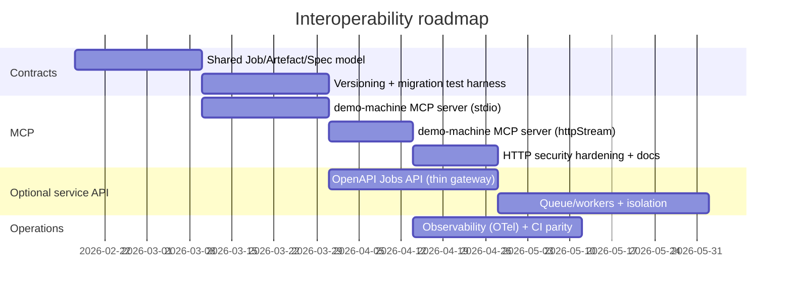

# Interoperability Design for the Two Machines

## Executive summary

The two machines already share several foundational choices: both are **TypeScript/Node.js**, both ship **CLI-first workflows**, and both expose **library-level APIs** via `src/index.ts` exports (so programmatic integration in Node is already possible without any new protocol). fileciteturn41file0L1-L1 fileciteturn40file1L1-L1

The key gap is that only the content machine currently has a first-class **MCP server** implementation (with both `stdio` and Streamable HTTP transport support), while the demo machine is CLI/library-only today. fileciteturn4file8L1-L1 fileciteturn4file9L1-L1 fileciteturn4file16L1-L1 fileciteturn13file6L1-L1

A pragmatic design that minimises maintenance cost while maximising reuse is:

- **Implement an MCP server for the demo machine** (recommended), mirroring the content machine’s proven patterns: dual transports (`stdio` for local agents; Streamable HTTP for remote/gateway deployment), session-aware artefacts, progress reporting, and safe-by-default binding. This aligns with the MCP spec’s Streamable HTTP guidance and its explicit security warnings (Origin validation, localhost binding for local runs, authentication for production). citeturn0search4
- **Treat MCP as the “agent integration surface”**, not the universal interoperability layer. MCP is JSON-RPC-based and excellent for tool invocation by LLM clients, but it is not automatically the best choice for general application-to-application integration (batching, bulk I/O, multi-tenant rate-limiting, binary artefact delivery). MCP’s own server tool model is principally about exposing tools/resources/prompts in a standard way to clients and models. citeturn7search0turn3search0
- **Add a thin, stable “Jobs + Artefacts” HTTP API (OpenAPI-defined) only if you truly need cross-language or remote service integration.** If your primary consumers are Node-based systems (or you can run Node sidecars), the existing libraries plus MCP may already cover most needs. If you need polyglot SDKs, organisational integration, or a hosted service, OpenAPI becomes the contract-of-record and lets you generate clients across languages. citeturn2search2turn2search4
- **Unify contracts** around three durable abstractions across both machines: `Job` (long-running execution), `Artefact` (produced media + metadata), and `Spec` (input). This reduces churn and makes both MCP and HTTP layers easier to keep backwards compatible. For long-running tasks, adopt a well-known “operation” pattern (job state + progress + eventual response or error). citeturn8search0turn8search6

The rest of this report justifies these recommendations by comparing architecture and protocol options, mapping API surfaces, and proposing a staged roadmap with risks.

## Scope and assumptions

This analysis is based on code and documentation in the two specified repositories on entity["company","GitHub","code hosting platform"], and on external primary sources (specifications and vendor documentation) for MCP, OpenAPI, JSON-RPC, gRPC, and operational patterns. fileciteturn4file0L1-L1 fileciteturn13file8L1-L1

Unspecified constraints are treated as assumptions, not fabricated requirements:

- **Deployment model** is unknown: local-only, hosted SaaS, or hybrid.
- **Concurrency/traffic** is unknown: could be single-user dev workflows or multi-tenant heavy workloads.
- **Networking** is unknown: same-machine calls vs cross-network calls vs internet-exposed endpoints.
- **Primary consumer** is unknown: LLM client via MCP, an internal orchestrator service, CI pipelines, or third-party developers.
- **Security posture** is unknown: “trusted local dev machine” vs “zero-trust network environment”.
- **Target language ecosystems** are unknown beyond the repos’ current TypeScript focus; therefore SDK language recommendations are framed as decision points.

These uncertainties matter because they change the “best” interface: local single-user use strongly favours `stdio` MCP and direct library calls; hosted service use pushes towards authenticated HTTP APIs and asynchronous job models. citeturn0search4turn8search0

## Current state of the two machines

### Content machine: pipeline + MCP server already present

The content machine is organised as a CLI-first, stage-based pipeline that produces intermediate artefacts (script, audio/timestamps, visuals plan, final render), while also exporting a library API for programmatic use. fileciteturn4file0L1-L1 fileciteturn41file0L1-L1

An MCP server is already implemented and documented. Core characteristics visible from the repo structure:

- A dedicated MCP server module (`src/server/mcp/server.ts`, `tools.ts`, session store, and CLI wiring). fileciteturn4file8L1-L1 fileciteturn4file9L1-L1 fileciteturn17file0L1-L1 fileciteturn4file5L1-L1
- Dual transport support: `stdio` and an HTTP streaming mode (implemented via a FastMCP dependency in the package). fileciteturn3file9L1-L1 fileciteturn4file8L1-L1
- Session-aware operation with an artefact directory per session, plus path restrictions for tool arguments that reference files (a key safety/containment measure). fileciteturn17file0L1-L1 fileciteturn4file16L1-L1
- A well-defined tool surface that maps to pipeline stages (`research`, `generate_script`, `generate_audio`, `match_visuals`, `render_video`, plus session inspection/reset). fileciteturn4file9L1-L1 fileciteturn4file16L1-L1

From a delivery standpoint, the content machine has a relatively mature “engineering hygiene” baseline (CI quality gates, code scanning, release/publish workflows), which reduces the marginal cost of adding contract tests and compatibility checks for new interoperability layers. fileciteturn32file19L1-L1

### Demo machine: CLI + library exports, but no MCP server yet

The demo machine focuses on “demo as code”: a YAML spec drives a browser automation capture and post-processing pipeline (Playwright-driven capture + FFmpeg rendering + optional TTS/subtitles), with a CLI that exposes `validate`, `capture`, `run`, and `edit`. fileciteturn13file8L1-L1 fileciteturn13file6L1-L1

Notably, it already exports a rich internal API via `src/index.ts` (spec loader/validator, runner lifecycle, playback engine, capture artefacts, editor/timeline renderer, narration providers, redaction utilities, logging). This means **an SDK exists today for TypeScript users**—it is just not packaged as a “remote callable” server interface. fileciteturn40file1L1-L1

The demo spec schema is Zod-based and strongly typed, but appears to lack an explicit top-level `schemaVersion` field, which will matter for long-term backwards compatibility if you publish/consume specs across versions. fileciteturn13file5L1-L1

Compared to the content machine, there is no visible MCP server entry point in the repo structure, and an attempted fetch of a conventional `.github/workflows/ci.yml` path returns not found, suggesting CI hardening may be an area to align as you add network-facing surfaces. citeturn0search4

## Architecture and protocol options

### Decision framing: what MCP is good for, and what it is not

MCP provides a standard way for clients to discover and invoke tools via **JSON-RPC 2.0**, including the ability to list tools and their input schemas. citeturn3search0turn7search0 MCP Streamable HTTP uses a single MCP endpoint supporting POST and (optionally) GET for server-sent events, with explicit session semantics (`Mcp-Session-Id`) and resumability guidance (`Last-Event-ID`), plus protocol versioning via `MCP-Protocol-Version`. citeturn0search1turn0search0

Crucially, the MCP spec includes an explicit security warning for Streamable HTTP: validate `Origin` to mitigate DNS rebinding, bind to localhost for local deployments, and implement proper authentication for production. citeturn0search4turn0search5

These properties make MCP excellent for:

- Tool invocation and agent workflows (especially where discovery and “tool semantics” matter).
- Local integrations via `stdio` (no network exposure, simple mental model).
- Human-in-the-loop workflows where the client UI mediates tool use (consistent with MCP’s tooling guidance). citeturn3search0

MCP is comparatively weaker for:

- Bulk artefact transfer (large MP4s, WebM capture files, WAV audio) where you want resumable downloads, CDN integration, byte-range requests, etc.
- Multi-tenant API management (rate limiting, quotas, fine-grained authorisation) without building a second layer anyway.
- Strongly typed polyglot clients where OpenAPI/gRPC ecosystems are dominant.

### Comparative architecture table

| Option                             | Primary interfaces                                                      | Strengths                                                                                                                                                            | Weaknesses                                                                                                                                    | Most appropriate when                                                                                         |
| ---------------------------------- | ----------------------------------------------------------------------- | -------------------------------------------------------------------------------------------------------------------------------------------------------------------- | --------------------------------------------------------------------------------------------------------------------------------------------- | ------------------------------------------------------------------------------------------------------------- |
| MCP-only (stdio + Streamable HTTP) | MCP tool surface over JSON-RPC; Streamable HTTP transport               | Standardised discovery (`tools/list`) and invocation; good LLM client fit; can stream progress/events; simplest for agent use cases citeturn3search0turn0search4 | Not a natural fit for large binary artefacts; must implement security controls for HTTP; may still need a “job/artefact” model for long tasks | Primary consumer is an MCP-capable LLM client; workflows are largely tool-centric, not general-purpose API    |
| Library/SDK-only                   | Direct TypeScript imports (existing)                                    | Lowest latency and complexity; best typing; no network/auth burden; easiest to test and refactor                                                                     | Only works in-process + same language/runtime; hard to integrate across services/languages                                                    | You control the runtime (Node) and don’t need remote execution                                                |
| REST/HTTP with OpenAPI             | HTTP endpoints + OpenAPI contract                                       | Language-agnostic; tooling for docs, mocks, client generation, contract tests citeturn2search2turn2search4                                                       | You must design versioning, auth, pagination, idempotency; streaming/progress patterns need care                                              | You need stable integration for multiple services/languages or external developers                            |
| gRPC (optionally gRPC-web)         | Protobuf APIs; streaming RPCs                                           | First-class streaming (server/client/bidi); strong typing; good internal services fit citeturn7search1                                                            | Harder for public-web clients; infrastructure overhead; gateway often needed                                                                  | High-throughput internal service mesh; strong need for streamed progress/events                               |
| WebSocket API                      | Stateful bidirectional channel                                          | Real-time progress, interactive sessions                                                                                                                             | Operational complexity (connection management, proxies, auth); not as standardised for “API-as-docs”                                          | Interactive UIs that need near-real-time control and telemetry                                                |
| Message queue + worker model       | Queue (Kafka/RabbitMQ/etc) + worker executors; optional HTTP front door | Best scaling for long-running jobs; decouples submission from execution; resilience patterns                                                                         | Exactly-once is hard; must design idempotency; more moving parts; eventual consistency citeturn9search0turn9search9turn9search5          | Multi-tenant workloads, bursty traffic, or expensive tasks (rendering, browser capture) that must be isolated |

### Recommended architecture pattern: dual-surface with shared contracts

A stable approach that avoids “interface sprawl” is:

- **Surface A (agent layer): MCP servers** for each machine, exposing a carefully curated set of tools (small, composable, and safe).
- **Surface B (programmatic/service layer): optional Jobs API** using OpenAPI for job submission, cancellation, status/progress, and artefact retrieval.
- **Shared contracts** underneath: the same internal type schemas (Zod → JSON Schema), the same `Job` lifecycle model, and the same artefact metadata model.

Mermaid sketch:

```mermaid
flowchart LR
  subgraph Clients
    A1[LLM client / MCP client]
    A2[CI / orchestrator service]
    A3[Developer scripts]
  end

  subgraph ContentMachine["Content machine"]
    CM_MCP[MCP server<br/>(stdio / httpStream)]
    CM_LIB[TS library API]
    CM_CORE[Pipeline stages<br/>script/audio/visuals/render]
    CM_STORE[(Artefact storage)]
  end

  subgraph DemoMachine["Demo machine"]
    DM_MCP[MCP server<br/>(stdio / httpStream)]
    DM_LIB[TS library API]
    DM_CORE[Capture + edit pipeline<br/>runner/playback/capture/render]
    DM_STORE[(Artefact storage)]
  end

  subgraph OptionalGateway["Optional HTTP gateway"]
    GW_API[REST Jobs API<br/>(OpenAPI)]
    GW_Q[(Queue / worker pool)]
  end

  A1 -->|MCP| CM_MCP
  A1 -->|MCP| DM_MCP

  A3 -->|imports| CM_LIB
  A3 -->|imports| DM_LIB

  A2 -->|HTTP| GW_API
  GW_API --> GW_Q
  GW_Q --> CM_CORE
  GW_Q --> DM_CORE

  CM_MCP --> CM_CORE --> CM_STORE
  DM_MCP --> DM_CORE --> DM_STORE
```

This design is deliberately modular: if you never need hosted multi-tenant execution, you can omit the gateway and queue layer and still have excellent interoperability via MCP + TypeScript libraries.

## API surface, schemas, versioning, and compatibility

### Normalising the capability model

Today, the content machine’s MCP tools map directly to pipeline stages (research → script → audio/timestamps → visuals → render), while the demo machine’s CLI maps to validate/capture/run/edit flows. fileciteturn4file16L1-L1 fileciteturn13file6L1-L1

To reduce future breaking changes, define a canonical capability taxonomy shared across both:

- **Synchronous “small” operations**: validate a spec, list supported templates/providers, estimate duration, etc.
- **Asynchronous “job” operations**: generate a video, capture a browser session, render an edited timeline.

This matches how long-running APIs are commonly documented: submit, poll status/progress, then fetch result (or error). citeturn8search0turn8search6

### Data models and schema strategy

Both repos already rely heavily on Zod schemas, which is a good foundation for:

- **Runtime validation** at the boundaries (MCP tool inputs; HTTP request bodies).
- **Generating JSON Schema** for documentation and client generation (especially if you later define OpenAPI 3.1, which aligns closely with JSON Schema vocabularies). citeturn2search2

Recommendations:

- Treat **Zod schemas as the internal source of truth**, but publish an exported, versioned JSON Schema artefact for:
  - MCP tool input schemas (already core to MCP tooling). citeturn3search0
  - Optional OpenAPI request/response bodies. citeturn2search2
- Introduce a consistent `schemaVersion` field where it is missing (likely the demo spec), and make migrations explicit. The content machine already uses schema versioning for script outputs and preserves legacy fields for backwards compatibility, which is a pattern worth mirroring. fileciteturn25file0L1-L1

### Versioning and backwards compatibility discipline

For package-level versioning, follow Semantic Versioning (SemVer): increment MAJOR for breaking API changes, MINOR for backwards compatible additions, PATCH for backwards compatible fixes. citeturn1search0

For protocol/API compatibility, use layered versioning:

- **MCP protocol versioning**: respect `MCP-Protocol-Version` handling as required/defined in the MCP transport spec, especially for HTTP transport. citeturn0search1
- **Tool contract versioning**: do not rename tool methods casually. Add new tools; deprecate old ones; keep old ones until you can bump a MAJOR version. This aligns with SemVer’s requirement that you “declare a public API” and manage deprecations explicitly. citeturn1search0turn3search0
- **Artefact schema versioning**: every persisted JSON artefact should embed its schema version to support long-term reproducibility.

A practical “compatibility test” approach:

- For each tool/endpoint, maintain **golden input/output fixtures** and run them in CI across supported versions.
- For artefacts, add a **migration test suite**: old → new migrations must be deterministic, and new code must still read N-1 artefacts.

## Authentication, authorisation, security, performance, observability, and scaling

### Security posture by transport

**STDIO MCP (local):**  
Low surface area, but still needs containment. File system access, invoking FFmpeg, launching browsers, and rendering pipelines are all powerful. Continue to sandbox file paths to an artefact directory and avoid arbitrary path traversal; the content machine already treats path parameters as session-scoped, which is a good baseline to replicate in the demo machine MCP server. fileciteturn17file0L1-L1 fileciteturn4file16L1-L1

**Streamable HTTP MCP (remote/local network):**  
The MCP spec’s security warning should be treated as non-optional if you bind to anything beyond localhost: validate `Origin` to mitigate DNS rebinding, bind to localhost for local deployments, and implement proper authentication (and TLS for production). citeturn0search4turn0search5

If you introduce an OpenAPI Jobs API, you also need:

- AuthN: API keys for internal systems or OAuth 2.0/OIDC for user-delegated access, plus documented discovery metadata endpoints if you want automated clients (OAuth metadata standardised in RFC 8414). citeturn6search1
- AuthZ: per-user/project scoping; least privilege; separate “submit job” from “read artefacts”.
- Protection against SSRF and browser abuse (demo machine runs browsers; you must constrain what URLs can be navigated to if it ever runs in a multi-tenant environment).

### Long-running workloads and resource isolation

Rendering and browser capture are inherently resource-heavy. If you anticipate concurrency (even modest), prioritise an execution model that isolates jobs:

- **Single-host, low concurrency**: in-process execution with a bounded job queue and a per-job working directory may be sufficient.
- **Multi-tenant or bursty workloads**: push jobs to a queue and run them in isolated workers/containers (one job per worker instance, or per-user limits).

If you adopt queues, assume **at-least-once delivery** is the default reliability stance in many systems; design idempotency keys and deduplication accordingly (Cloudflare Queues explicitly recommends idempotency keys because duplicates can occur). citeturn9search0  
Similarly, messaging systems commonly trade off between at-most-once, at-least-once, and exactly-once semantics; “exactly once” is nuanced and often requires careful end-to-end design. citeturn9search9turn9search4

### Observability

Interoperability layers are only maintainable if failures are diagnosable. Minimum viable observability for both machines, regardless of interface:

- Structured logs with request/job correlation IDs.
- Progress reporting for long tools (MCP supports progress notifications; gRPC/WS can stream updates). citeturn3search0turn7search1
- Metrics (job duration, failure rates, queue depth, artefact sizes).
- Distributed tracing if you have a gateway + workers, ideally aligned to OpenTelemetry conventions (OTLP defines how telemetry can be transported over gRPC/HTTP). citeturn8search8turn8search3

### Maintenance cost considerations

Each additional surface area multiplies your compatibility matrix:

- MCP tool surface × two transports (stdio/httpStream) × client implementations.
- Optional REST API × SDK language targets × versioned schemas.
- Queue/worker infrastructure × deployment targets.

This is why “MCP-only + TypeScript SDK” is the lowest-maintenance path if it meets your needs, and why a Jobs API should be introduced only when you have a clear consumer that cannot be satisfied with Node imports or MCP. citeturn2search2turn1search0

## SDK and library strategy

### What you already have

Both machines already export TypeScript-first programmatic entry points (`src/index.ts`). fileciteturn41file0L1-L1 fileciteturn40file1L1-L1

Therefore, “create libraries/SDKs” is not a greenfield effort; it is a question of **stabilising and packaging** what already exists, plus optionally providing cross-language clients.

### SDK language choice table

The right set depends on who will integrate. The table below frames trade-offs without assuming your audience.

| SDK target                      | When it is worth doing                                      | Upside                                                                                                                                                   | Cost/risks                                                                                             |
| ------------------------------- | ----------------------------------------------------------- | -------------------------------------------------------------------------------------------------------------------------------------------------------- | ------------------------------------------------------------------------------------------------------ |
| TypeScript/JavaScript (primary) | Default: repos are TS-first                                 | Best typing fidelity; lowest incremental maintenance; matches existing exports and CLI runtime fileciteturn41file0L1-L1 fileciteturn40file1L1-L1 | Need to clarify public vs internal APIs; keep SemVer discipline citeturn1search0                    |
| Python                          | If “AI workflows” and data pipelines are dominant consumers | Broad ecosystem; straightforward HTTP client generation from OpenAPI; common in agent tooling                                                            | Extra packaging + CI matrix; risk of drift unless generated from a single contract citeturn2search2 |
| Go                              | If you need a tight, fast, single-binary orchestrator       | Good for services; strong concurrency; good gRPC support citeturn7search1                                                                             | Higher initial cost; less natural for browser/tooling heavy dev flows                                  |
| .NET / Java                     | If enterprise service integration is a requirement          | Standard enterprise stacks; OpenAPI client generation commonplace citeturn2search2                                                                    | Only worth it with clear demand; otherwise heavy maintenance                                           |

### Packaging and distribution recommendations

A coherent distribution strategy reduces integration friction:

- Keep CLIs as the “human entry point” and libraries as the “developer entry point”.
- If you add MCP to the demo machine, ship it as a CLI subcommand (mirroring the content machine’s `cm mcp` pattern). fileciteturn4file5L1-L1
- If you add an OpenAPI jobs layer, publish:
  - the OpenAPI document itself (versioned),
  - generated clients (or at least generation scripts),
  - a minimal reference server/gateway.

OpenAPI is explicitly designed to enable documentation generation and client/server code generation tooling. citeturn2search2

## Roadmap, effort, and risk register

### Proposed milestones

The milestones below are sequenced to deliver value early while constraining architectural commitments until needed.

| Milestone                     | Key deliverables                                                                                                                                        | Effort | Primary risks                                                                                                           |
| ----------------------------- | ------------------------------------------------------------------------------------------------------------------------------------------------------- | ------ | ----------------------------------------------------------------------------------------------------------------------- |
| Contract alignment            | Define shared `Job`, `Artefact`, and `Spec` concepts; add missing `schemaVersion` where needed; publish schema fixtures                                 | Medium | Bikeshedding on naming; hidden coupling between internal modules; migrations underestimated citeturn1search0         |
| Demo machine MCP server       | `demo-machine mcp` command; tools for `validate_spec`, `run_demo`, `capture_demo`, `edit_from_events`; progress reporting; session artefact directories | Medium | Tool granularity wrong (too coarse); artefact path safety; long job cancellation semantics                              |
| MCP security hardening (HTTP) | Origin validation; localhost-by-default; auth hooks; document safe deployment posture                                                                   | Medium | Security regressions; breaking changes for existing clients; misconfiguration exposure citeturn0search4turn0search5 |
| Optional Jobs API (OpenAPI)   | `/jobs` submit/status/cancel; `/artefacts` download metadata + signed URLs/paths; OpenAPI 3.1.x contract and generated clients                          | High   | Scope creep; artefact delivery complexity; backwards compatibility burden citeturn2search2turn2search4              |
| Scaling layer (queue/workers) | Worker pool running isolated jobs; idempotency keys; retry policy; deduplication strategy                                                               | High   | Duplicate processing; cost; operational complexity; “exactly once” misunderstandings citeturn9search0turn9search9   |
| Observability and CI parity   | Contract tests; golden fixtures; trace/log correlation; performance baselines                                                                           | Medium | Too much instrumentation too early; CI flakiness (browser/render tests) citeturn8search8turn7search1                |

### Timeline sketch



This timeline is intentionally coarse: the key is dependency ordering (contracts → MCP for demo machine → optional service API/scaling).

### Concrete next steps

Immediate steps that keep options open:

1. **Define the public API boundary for each machine** (what is stable vs internal), then align SemVer expectations to that public surface. citeturn1search0
2. **Draft a shared contract document** with:
   - `Job` states (queued/running/succeeded/failed/cancelled),
   - progress reporting model,
   - artefact metadata schema,
   - `schemaVersion` rules and migration policy. citeturn8search0turn8search6
3. **Implement demo machine MCP server** with a strict, minimal tool set first, optimised for composability (validate → capture → render), then expand as real workflows demand. Ensure it follows MCP Streamable HTTP behaviour and security guidance if you expose it over HTTP. citeturn0search4turn3search0
4. **Add contract tests** that assert tool names, input schemas, and output schema versions to prevent drift across releases (this is where the content machine’s existing CI maturity can be leveraged as a model). fileciteturn32file18L1-L1
5. **Defer the OpenAPI Jobs API until a concrete non-Node consumer exists** (or until you need hosted execution). When you do add it, treat the OpenAPI 3.1.x document as the contract-of-record and generate clients from it. citeturn2search2turn2search4
