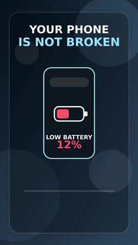

# Faceless Mixed Short

Status: `showcase candidate`

Tracked demo:

  

Use this lane when a faceless short needs more than one visual source
type: stock-like support, diagrams, phone or app UI, cards, generated
assets, captions, and music.

Core shape:

- voiceover-first script with a practical or curiosity hook
- deliberate visual source changes between beats
- captions that stay readable across all source types
- low music bed that supports narration without masking it
- publish-prep review on the final MP4, not just asset existence

Current proving result:

- Final local MP4:
  `experiments/proving-wave-3/faceless-mixed-short/outputs/final/video.mp4`
- Tracked preview MP4:
  [`docs/demo/demo-15-faceless-mixed-short.mp4`](../../demo/demo-15-faceless-mixed-short.mp4)
- Publish-prep passed with portrait format, `39.4s` duration, cadence,
  and audio-signal checks.
- OCR caption-sync was not run for this FFmpeg fallback render because
  there is no `captions.remotion.json` sidecar yet.

Primary skill:

- [faceless-mixed-short](../../../skills/faceless-mixed-short/SKILL.md)

Related skills:

- [stock-footage-edutainment-short](../../../skills/stock-footage-edutainment-short/SKILL.md)
- [animation-explainer-short](../../../skills/animation-explainer-short/SKILL.md)
- [motion-design-coder](../../../skills/motion-design-coder/SKILL.md)
- [short-form-captions](../../../skills/short-form-captions/SKILL.md)
- [publish-prep-review](../../../skills/publish-prep-review/SKILL.md)

Use `motion-design-coder` whenever this lane adds diagrams, UI cards,
HTML/SVG assets, kinetic type, or Remotion-native scene animation. It
should define beat frames and review frames before the final render.
