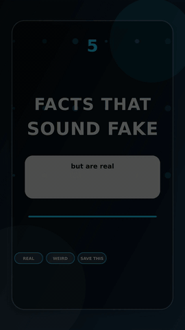

# Facts Listicle

Status: `showcase candidate`

Tracked demo:

  

Use this lane when the strongest format is a compact countdown, “things
you didn't know,” or fast facts sequence.

Core shape:

- open on the strangest or strongest fact
- one fact per beat
- explicit sequence markers
- support visuals reset between facts
- real voiceover with caption timing, not mock or silent audio
- visual cadence pulses or hard resets often enough for short-form pace

Current proving result:

- Final local MP4:
  `experiments/proving-wave-3/fast-facts-countdown/outputs/final/video.mp4`
- Tracked preview MP4:
  [`docs/demo/demo-13-fast-facts-countdown.mp4`](../../demo/demo-13-fast-facts-countdown.mp4)
- Publish-prep passed with portrait format, `30.5s` duration, cadence,
  and audio-signal checks.
- OCR caption-sync was not run for this FFmpeg fallback render because
  there is no `captions.remotion.json` sidecar yet.

Primary skill:

- [facts-listicle-short](../../../skills/facts-listicle-short/SKILL.md)

Related skills:

- [stock-footage-edutainment-short](../../../skills/stock-footage-edutainment-short/SKILL.md)
- [motion-design-coder](../../../skills/motion-design-coder/SKILL.md)
- [motion-card-lesson-short](../../../skills/motion-card-lesson-short/SKILL.md)
- [short-form-captions](../../../skills/short-form-captions/SKILL.md)

Use `motion-design-coder` for countdown cards, number pops, fact-card
resets, and CTA pulses. The listicle should not rely on static cards or
CSS clocks when rendered through Remotion.
