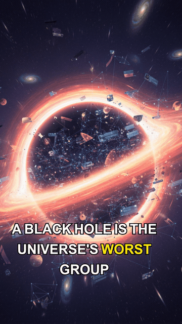

# Gemini Image-Led Shorts

This example set tracks three real Content Machine renders that use Gemini image generation via `nanobanana` for the visual layer.

These are real rendered MP4 outputs with voice audio and captions. They are image-led examples, not true Veo video generations yet.

## Included examples

### 1. 2026 Feels Like 2016

- Full video: [demo-5-gemini-2026-feels-like-2016.mp4](../../demo/demo-5-gemini-2026-feels-like-2016.mp4)
- Preview GIF: 

### 2. Browser Cache, Same Energy

- Full video: [demo-6-gemini-browser-cache-same-energy.mp4](../../demo/demo-6-gemini-browser-cache-same-energy.mp4)
- Preview GIF: 

### 3. Black Holes, Absurdist

- Full video: [demo-7-gemini-black-holes-absurdist.mp4](../../demo/demo-7-gemini-black-holes-absurdist.mp4)
- Preview GIF: 

## Reproduction Notes

- Workflow presets: [`gemini-meme-explainer`](../../reference/cm-workflows-reference-20260110.md) and [`absurdist-edutainment`](../../reference/cm-workflows-reference-20260110.md)
- Topic fixture data: [`test-fixtures/generate/high-hook-review-batch-20260306.json`](../../../test-fixtures/generate/high-hook-review-batch-20260306.json)
- Visual provider: `nanobanana`
- Current motion path: image-led render flow with static/Ken Burns style motion, not Vertex Veo

## Prereqs

- `GEMINI_API_KEY` or `GOOGLE_API_KEY`
- a working audio path such as `kokoro` or Google TTS
- Remotion render dependencies installed locally

## Minimal shape

The real review renders were created by generating visuals with `nanobanana`, then rendering those artifacts through the normal audio/timestamps/render pipeline.

```bash
cm visuals \
  --input output/timestamps.json \
  --provider nanobanana \
  --routing-policy configured \
  --motion-strategy kenburns \
  --output output/visuals.json

cm generate "Browser cache explained like the internet's most annoying roommate" \
  --workflow gemini-meme-explainer \
  --archetype hot-take \
  --visuals-motion-strategy kenburns \
  --output output/video.mp4
```
