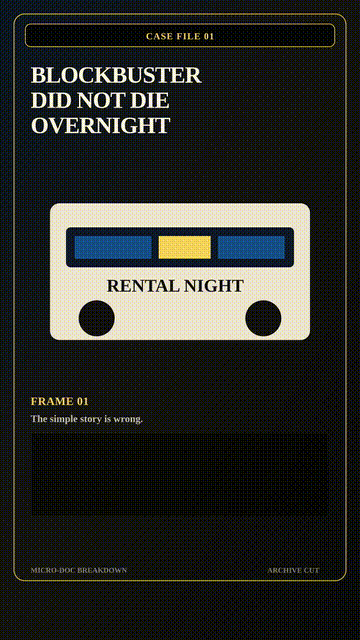

# Micro-Doc Breakdown

Status: `proving candidate`

This is the current proving candidate for documentary-style explainers.
It turns a simple myth into a compact mechanism-driven short with
archive cards, receipts, timelines, evidence inserts, voiceover,
captions, and publish-prep review.

  

## Example

- Topic: `how Blockbuster actually died`
- Lane: `micro-doc-breakdown`
- Skill: [`micro-doc-breakdown-short`](../../../skills/micro-doc-breakdown-short/SKILL.md)
- Demo MP4:
  [`docs/demo/demo-17-micro-doc-breakdown.mp4`](../../demo/demo-17-micro-doc-breakdown.mp4)

## What This Proves

- The lane can produce a real 1080x1920 MP4 with narration and captions.
- The edit exercises documentary-native assets instead of generic stock
  wallpaper, but the current evidence-card inserts are still a proving
  workaround rather than the final visual bar.
- Cadence can pass when long visual scenes are split with real evidence
  inserts.
- The example keeps an honest review bundle under
  `experiments/proving-wave-3/micro-doc-breakdown/outputs/review/`.

## Current Review

- non-OCR publish-prep passed: resolution, duration, format, cadence,
  script score, and audio-signal
- OCR caption-sync still fails on median/P95 drift even though all
  expected caption segments were matched
- treat this as a proving candidate, not a golden caption-sync or final
  aesthetic reference

## Use This When

- the short explains a business, history, tech, culture, or science
  mechanism
- the hook is a myth correction, hidden cause, timeline, or artifact
  trail
- the result should be saveable and explanatory rather than pure story
  entertainment

## Motion Skill

- [motion-design-coder](../../../skills/motion-design-coder/SKILL.md)

Use this for evidence-card motion, receipt reveals, timeline draw-ons,
archive insert transitions, and caption-safe hold states. Micro-doc
animation should feel like editorial evidence, not decorative deck
motion.
