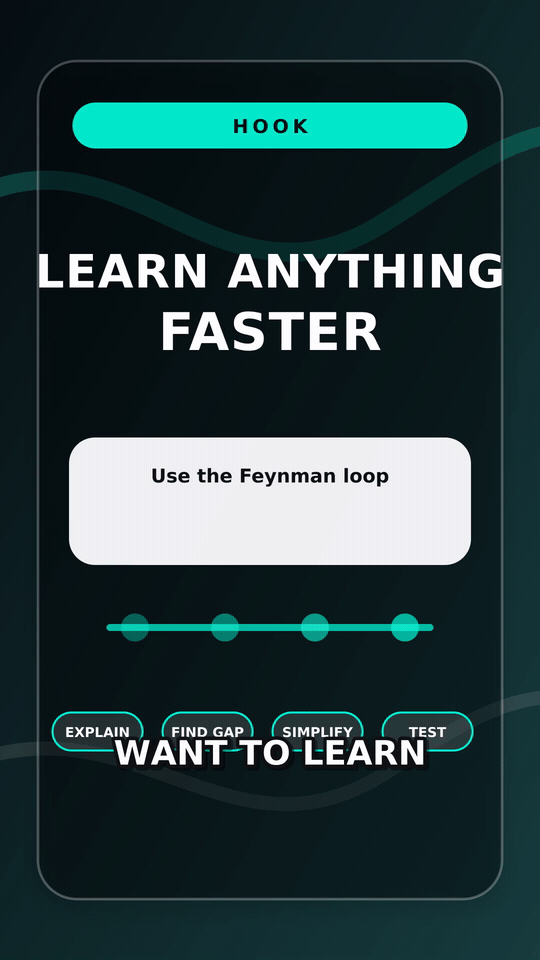

# Motion Card Lesson

Status: `showcase candidate`

Tracked demo:

<p align="center">
  <a href="../../demo/demo-14-motion-card-lesson.mp4">
    
  </a>
</p>

Use this lane for educational shorts that should feel like designed card
systems rather than stock-footage explainers.

Core shape:

- hook card first
- short sequence of prompt / clue / answer / recap beats
- motion only where it improves progression
- deterministic timing locked to real narration
- readable cards that carry the lesson even on mute
- captions that reinforce the card state instead of replacing it

Current proving result:

- Final local MP4:
  `experiments/proving-wave-3/motion-card-lesson/outputs/motion-card-v2/video.mp4`
- Motion brief:
  `experiments/proving-wave-3/motion-card-lesson/outputs/motion-card-v2/motion-brief.v1.json`
- Layout safety annotations:
  `docs/demo/demo-14-motion-card-lesson.layout.json`
- Tracked preview MP4:
  [`docs/demo/demo-14-motion-card-lesson.mp4`](../../demo/demo-14-motion-card-lesson.mp4)
- Repo video audit passed with portrait format, `30.25s` duration,
  H.264 `yuv420p`, audio present, caption-safe frame samples, and
  `video-evaluator/layout-safety-review` overlap checks.
- OCR caption-sync was not run for this FFmpeg fallback render because
  there is no `captions.remotion.json` sidecar yet.

Primary skill:

- [motion-card-lesson-short](../../../skills/motion-card-lesson-short/SKILL.md)

Related skills:

- [motion-design-coder](../../../skills/motion-design-coder/SKILL.md)
- [animation-explainer-short](../../../skills/animation-explainer-short/SKILL.md)
- [short-form-captions](../../../skills/short-form-captions/SKILL.md)
- [video-render](../../../skills/video-render/SKILL.md)

Use `motion-design-coder` for the card animation plan: frame-driven
entrances, readable hold states, deterministic card resets, caption-safe
motion, and phone-size review frames.

Regeneration command:

```bash
node experiments/proving-wave-3/motion-card-lesson/tools/build-motion-card-v2.mjs
```

Focused layout review:

```bash
VIDEO_EVALUATOR_ROOT=../video-evaluator

cat <<'JSON' | node "$VIDEO_EVALUATOR_ROOT/agent/run-tool.mjs" layout-safety-review
{
  "videoPath": "docs/demo/demo-14-motion-card-lesson.mp4",
  "layoutPath": "docs/demo/demo-14-motion-card-lesson.layout.json",
  "outputDir": "experiments/proving-wave-3/motion-card-lesson/outputs/motion-card-v2-layout-review",
  "runOcr": false
}
JSON
```

The demo audit script runs the same sidecar check through
`@45ck/video-evaluator` when the package is installed or a built sibling
checkout is available via `VIDEO_EVALUATOR_ROOT`.
